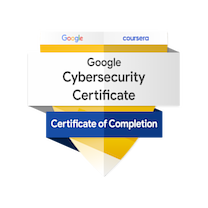
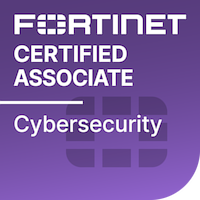
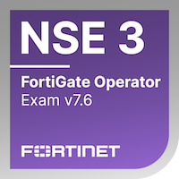
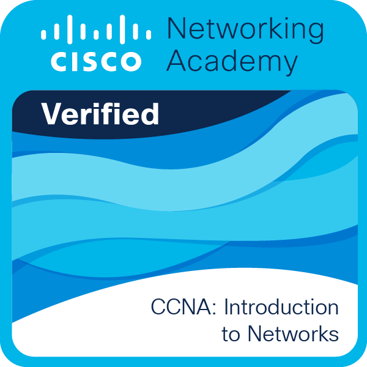

# Certifications

Professional certifications and verified digital credentials earned in cybersecurity, networking, and cloud security. Each entry links to a live, third-party verification source (Credly or the issuing platform) as well as the original certificate document.

<table>
  <tr>
    <td align="center" style="padding: 16px;">
      
       <b>Google Cybersecurity Professional Certificate</b>
    </td>
    <td align="center" style="padding: 16px;">
      
       <b>Fortinet Certified Associate in Cybersecurity</b>
    </td>
    <td align="center" style="padding: 16px;">
      
       <b>NSE 3 – FortiGate Operator Exam v7.6</b>
    </td>
    <td align="center" style="padding: 16px;">
      
       <b>CCNA: Introduction to Networks</b>
    </td>
  </tr>
</table>

---

## Certification Details

| Certification | Issuing Organization | Date | Credential / Verification | Document |
| :--- | :--- | :--- | :--- | :--- |
| **Google Cybersecurity Professional Certificate** | Google, via Coursera | Issued Aug 23, 2025 | [Credly Badge](https://www.credly.com/go/r40cBjqO) • [Coursera Verification](https://coursera.org/verify/professional-cert/PI4BPP81NMYI) (ID `PI4BPP81NMYI`) | [Coursera Certificate](<./Coursera PI4BPP81NMYI.pdf>) • [Credly Badge PDF](./GoogleCybersecurityProfessionalCertificateV2_Badge20250823-33-5zeksj.pdf) |
| **Fortinet Certified Associate in Cybersecurity** | Fortinet | Achieved Mar 9, 2026 · Valid until Mar 9, 2028 | [Credly Badge](https://www.credly.com/earner/earned/badge/77f49afa-bb70-4b71-a741-4f529794e6ff) • Validation No. `8974680442RD` ([verify](https://training.fortinet.com/admin/tool/certificate/index.php)) | [Certificate PDF](<./Fortinet Certified Associate in Cybersecurity.PDF.pdf>) |
| **NSE 3 – FortiGate Operator Exam v7.6** | Fortinet (NSE Training Institute) | — | [Fortinet NSE Program](https://training.fortinet.com) | *(exam completion badge; no downloadable certificate issued)* |
| **CCNA: Introduction to Networks** | Cisco Networking Academy, via St. Petersburg College | Completion Date: Jul 20, 2026 | Cert ID `537afdb4-09ae-4337-a685-a0d69d4846f4` · Instructor: Michael Gordon | [Certificate PDF](./CCNA-_Introduction_to_Networks_certificate_rduckw2-live-spcollege-edu_537afdb4-09ae-4337-a685-a0d69d4846f4.pdf) |

---

## Coursework Covered (Google Cybersecurity Professional Certificate)

A 9-course, hands-on program covering entry-level cybersecurity competencies in Python, Linux, SQL, SIEM tooling, and Intrusion Detection Systems:

1. Foundations of Cybersecurity
2. Play It Safe: Manage Security Risks
3. Connect and Protect: Networks and Network Security
4. Tools of the Trade: Linux and SQL
5. Assets, Threats, and Vulnerabilities
6. Sound the Alarm: Detection and Response
7. Automate Cybersecurity Tasks with Python
8. Put It to Work: Prepare for Cybersecurity Jobs

---

_Return to the [main portfolio](../README.md)._
