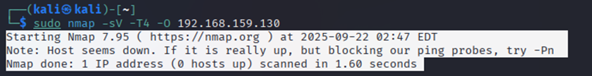

Project: End-to-End Vulnerability Assessment & Penetration Test on a Simulated Corporate Network
Summary
This project simulates a full professional security engagement, from initial scoping to final exploitation. It demonstrates a comprehensive workflow for identifying, validating, and reporting on security vulnerabilities within a controlled lab environment that mimics a typical Small Business (SMB) network. The project highlights both the business/legal framework of a security audit and the hands-on technical execution, showcasing a holistic understanding of modern cybersecurity practices.

Tools & Technologies Used:

Virtualization: VMware Workstation

Operating Systems: Kali Linux (Attacker), Metasploitable 2 (Target)

Reconnaissance: Nmap

Vulnerability Scanning: Nessus Essentials

Exploitation: Metasploit Framework

Section 1: The Engagement (The Business Context)
A successful and ethical security audit is built on a foundation of clear communication, legal authorization, and mutually agreed-upon rules. Before any technical work begins, a professional engagement is framed by two key documents:

Statement of Work (SOW): This document legally defines the scope of the engagement—what is being tested, the objectives, and the deliverables. It serves as the master plan for the project. (See SOW.md for the full document.)

Rules of Engagement (RoE): This document defines the how of the test—the permitted methodologies, the testing timeline, communication protocols, and critical restrictions. It ensures the test is conducted safely and professionally. (See RoE.md for the full document.)

By establishing this framework, we ensure that the technical assessment is aligned with the client's business goals and legal requirements.

Section 2: The Execution (The Technical Walkthrough)
This section details the hands-on technical phases of the simulated engagement. Each step is presented not just as a command that was run, but as a conclusion derived from analysis and troubleshooting—a core skill in cybersecurity.

2.1. Lab Setup & Network Troubleshooting
Objective: To create a safe, isolated network environment containing an attacker machine and a target server, mirroring a consultant's position on a client's internal network.

Execution:
The lab was constructed using two virtual machines:

Attacker VM: A fully updated Kali Linux instance.

Target VM: The intentionally vulnerable Metasploitable 2 server.

Networking Deep Dive & Troubleshooting:
Upon initial setup with a "Host-Only" network configuration, a connectivity issue was immediately identified: the attacker and target machines could not communicate. My diagnostic process was as follows:

Hypothesis: The VMs, despite being in the same logical network group in VMware, have been assigned IP addresses on different subnets, preventing them from routing traffic to each other.

Test: I ran ip addr show eth0 on the Kali machine and ifconfig on the Metasploitable machine to verify their assigned network addresses.

Conclusion: The outputs confirmed the hypothesis. The Kali VM was on one subnet, while the Metasploitable VM was on another, making communication impossible.

Remediation: To resolve this, I re-configured both virtual machines' network adapters to use the NAT setting in VMware. This ensures that the VMware DHCP service assigns both VMs addresses within the same subnet, placing them on the same broadcast domain and enabling direct communication. A final check of the IP addresses confirmed they were now on the same network (192.168.59.0/24), and the lab was fully operational. This troubleshooting step is critical, as establishing a stable and correct network baseline is a prerequisite for any successful internal assessment.

2.2. Phase 1: Reconnaissance with Nmap
Objective: To create a detailed map of the in-scope target, identifying all open ports, the services running on them, and the underlying operating system. This information forms the attack surface and is foundational for all subsequent testing.

Execution & Analysis:
The reconnaissance phase began with an active scan of the target (192.168.59.130) using Nmap. The initial scan attempts were unsuccessful, returning a Host seems down message.

Analysis: This response indicated that the target was likely protected by a host-based firewall configured to drop ICMP echo requests (pings), a common technique to evade simple network discovery.

Revised Strategy: To bypass this, I utilized the -Pn flag in my Nmap command. This instructs Nmap to skip the initial host discovery (ping sweep) and proceed directly to a full port scan, treating the host as if it is already known to be online.

The final, successful command was executed with administrative privileges to enable a more reliable and stealthy SYN scan:
sudo nmap -sV -T4 -O -Pn 192.168.59.130

Results:
The scan produced a comprehensive list of open ports and services. The output immediately revealed several high-risk services, providing a clear path forward for the vulnerability analysis phase. Key findings included:

Outdated and Insecure Services: The presence of services like vsftpd 2.3.4 (FTP), telnet, and UnrealIRCd strongly suggested the presence of critical vulnerabilities.

Known Backdoors: The discovery of a service on port 1524 explicitly identified as a "Metasploitable root shell" indicated a deliberate backdoor.

Broad Attack Surface: A wide range of open ports (23 TCP ports in total) indicated a large and complex attack surface requiring in-depth analysis.

This reconnaissance data served as the "treasure map" for the rest of the engagement, allowing me to transition from broad discovery to targeted vulnerability analysis.

2.3. Phase 2: Vulnerability Analysis with Nessus
Objective: To systematically analyze the services discovered during reconnaissance against a comprehensive database of known vulnerabilities, and to prioritize findings based on risk.

Execution & Analysis:
While Nmap provided the map of the attack surface, Nessus Essentials was chosen to provide the in-depth analysis. Nessus is an industry-standard vulnerability scanner that automates the process of testing each service for thousands of known security flaws.

A "Basic Network Scan" was configured and launched against the target (192.168.59.130). This scan policy is comprehensive, providing a strong baseline for an initial assessment.

Results:
The scan completed successfully and produced a detailed report, immediately highlighting a significant number of high-impact vulnerabilities. The results were triaged using the built-in, color-coded severity rating (Critical, High, Medium, Low), which is essential for prioritizing remediation efforts in a real-world business context. The report confirmed that several services were not just outdated, but critically misconfigured or contained known backdoors.

This automated analysis confirmed the initial hypotheses from the Nmap scan and provided a clear, prioritized list of weaknesses. The next logical step was to select a high-impact finding and attempt to validate it through manual exploitation, demonstrating the tangible risk to the "client."

2.4. Phase 3: Exploitation with Metasploit Framework
Objective: To validate a critical vulnerability identified by Nessus and demonstrate its real-world business impact. This moves the assessment from theoretical risk to proven compromise.

Execution & Analysis:
The "UnrealIRCd Backdoor Detection" was selected as the target for exploitation. The Metasploit Framework was used for this phase, as it is the industry-standard tool for safe and reliable exploitation.

The process began by searching for and loading the appropriate exploit module: exploit/unix/irc/unreal_ircd_3281_backdoor.

Troubleshooting Deep Dive:
My first attempt to run the exploit failed. A deeper analysis of the error message, Exploit failed: A payload has not been selected, revealed a key concept of the framework: the difference between an exploit and a payload.

Exploit: The code that takes advantage of a vulnerability to gain initial access (the "key to the door").

Payload: The code that runs after the exploit is successful (what you "do" once you're inside).

My initial command was missing the payload. To resolve this, I first listed the compatible payloads using show payloads. My next attempt failed because I chose a generic payload that was not compatible. I then selected a confirmed-compatible payload from the list, payload/cmd/unix/reverse, and configured it with the necessary LHOST (my Kali IP) and RHOSTS (the target IP) options.

Results: Successful System Compromise
With the correct exploit and payload configured, the attack was launched a final time. It succeeded, establishing a reverse shell command session from the target machine back to my Kali attacker machine.

Post-exploitation commands were run on the target to confirm the level of access:

whoami returned root, confirming the highest possible level of privilege.

hostname returned metasploitable, confirming control of the correct machine.

This successful exploitation provided undeniable proof of the critical risk identified by Nessus. It demonstrated that an attacker could easily move from remote network access to complete, administrative control of the server.

Section 3: Findings & Recommendations (The Deliverable)
The final and most crucial phase of any security engagement is translating the technical findings into a clear, actionable report for the client. This involves communicating risk from a business perspective and providing precise guidance for remediation.

3.1. Executive Summary
The vulnerability assessment performed on the internal server (192.168.59.130) revealed multiple critical-risk vulnerabilities that expose the asset to a high likelihood of compromise. The test confirmed that a remote, unauthenticated attacker on the local network could gain complete administrative control (root) of the server. This level of access would allow an attacker to read, modify, or delete any data on the system, install persistent malware such as ransomware, and use the server as a pivot point to launch further attacks against the internal network. Immediate remediation of the identified critical vulnerabilities is strongly recommended to mitigate the risk of a significant security breach.

3.2. Key Findings & Remediation Plan
The following table details the top three critical vulnerabilities discovered during the assessment, their potential business impact, and the recommended steps for remediation.

Vulnerability

Business Impact

Recommended Remediation

UnrealIRCd Backdoor

Complete system compromise. Allows an attacker to execute arbitrary commands as the root user, leading to total data and system control.

Immediate Action: The UnrealIRCd service should be disabled and removed from the server. If this service is business-critical, it must be updated to the latest patched version immediately.

VSFTPD v2.3.4 Backdoor

Complete system compromise. A known backdoor in this version of the FTP server allows for unauthorized remote command execution.

Immediate Action: The VSFTPD package must be upgraded to the latest stable version available through the system's package manager. FTP is an insecure protocol; consider replacing it with SFTP if possible.

Bind Shell on Port 1524

Unauthorized remote administrator access. The presence of an unprotected root shell provides a direct, persistent backdoor for an attacker.

Immediate Action: The process listening on TCP port 1524 must be identified and terminated. A full system audit should be conducted to determine how this backdoor was installed and to check for other signs of compromise.

This final deliverable provides the "client" with the necessary information to understand their security posture and take decisive action to improve it, fulfilling the primary objective of the engagement.