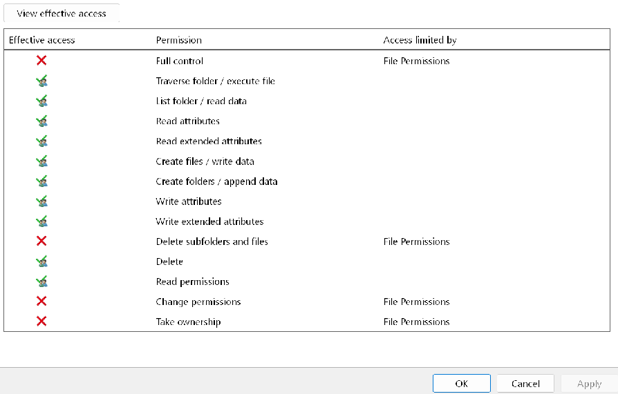
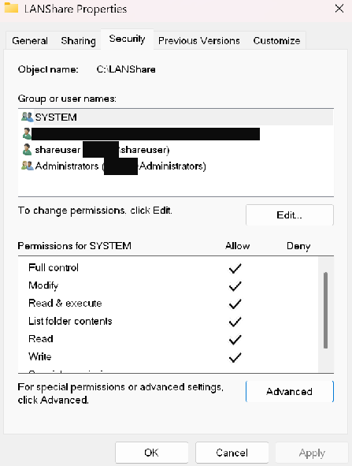
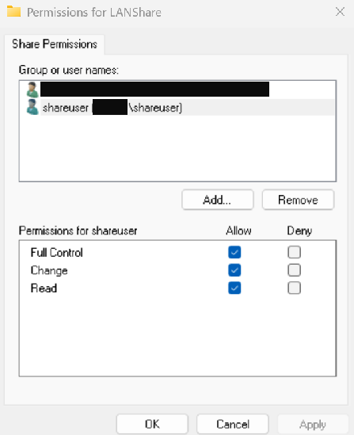

# Project: Secure Local Area Network (LAN) File Share Configuration

---

## Executive Summary

This project documents the secure implementation and multi-stage troubleshooting of a local network file share on a Windows 11 endpoint. The objective was to enable controlled access to a dedicated data repository from trusted mobile devices. The implementation faced three distinct challenges: a persistent authentication failure, a subsequent access denial due to a permissions conflict, and finally, an unintended data exposure incident where the system's C:\Users directory became visible on the network.

Systematic troubleshooting isolated and resolved each issue. The authentication failure was traced to a cloud-vs-local identity conflict and solved by creating a dedicated service account. The access denial was diagnosed using the "Effective Access" tool and traced to a Share vs. NTFS permission conflict. The final data exposure incident was caused by the accidental activation of Windows' "Public folder sharing" feature, which was identified and successfully remediated using PowerShell's SMB management cmdlets, completing the secure configuration of the endpoint.

---

## Core Concepts and Methodologies Applied

This project demonstrates a practical understanding of several key cybersecurity domains:

1.  **Defense-in-Depth Strategy**
    A multi-layered security architecture was implemented, with distinct controls at the Network Layer (Firewall), Share Layer (SMB Permissions), and File System Layer (NTFS Permissions).

2.  **Principle of Least Privilege**
    A "zero-trust" approach was taken by revoking all inherited permissions and explicitly granting only necessary privileges to a dedicated, non-administrative user account.

3.  **Network Segmentation and Attack Surface Reduction**
    The host's attack surface was minimized through the strategic use of a third-party firewall (Bitdefender) and context-aware security policies.
    

---

## Troubleshooting and Resolution

The project involved a three-phase troubleshooting process that highlights a systematic approach to diagnosing and remediating complex security issues post-implementation.

### Phase 1: Authentication Failure
**Challenge:** Initial connection attempts failed with an "incorrect information" error, which was traced to an identity translation conflict between the host's cloud-based Microsoft Account and the client's SMB protocol.

**Resolution:** A dedicated, non-privileged local user (`shareuser`) was created to act as a service account, providing a simple, unambiguous set of credentials for authentication.

### Phase 2: Access Denial (vfs.provider.smbj/access-denied)
**Challenge:** After successful authentication, attempts to view the folder's contents resulted in an access denied error.

**Root Cause Analysis:** The built-in **Effective Access** tool was used to diagnose the issue, revealing that overly restrictive Share Permissions were taking precedence over the correctly configured NTFS permissions.


**Resolution:** The `shareuser` account was granted appropriate permissions at the Share Level, resolving the conflict.

### Phase 3: Unintended Data Exposure Incident
**Challenge:** Following the successful configuration, a routine verification check revealed that the host's entire `C:\Users` directory had become visible on the network, creating a significant data exposure risk.

**Root Cause Analysis:** The incident was traced back to the accidental activation of the "Public folder sharing" toggle within Windows' Advanced Sharing Settings. This seemingly benign feature automatically creates a network share on the `C:\Users\Public` directory, which can cause the parent `C:\Users` directory to become discoverable.

**Incident Remediation (Command-Line Forensics):** An elevated PowerShell terminal was used to identify and remove the unauthorized share.

The `Get-SmbShare` cmdlet was used to list all active network shares and identify the rogue share pointing to `C:\Users`.
```powershell
Get-SmbShare
```
The `Remove-SmbShare` cmdlet was then used to immediately destroy the unauthorized share, closing the exposure vector.
```powershell
Remove-SmbShare -Name "Users" -Confirm:$false
```
**

**Lesson Learned:** This incident provided a critical lesson on the dangers of seemingly simple UI toggles and the importance of post-configuration auditing to verify that no unintended security changes have occurred.

### Technical Implementation Details
**Objective:** To create a dedicated, secure folder at `C:\LANShare`.

**Creation of a Dedicated Service Account:**
An elevated PowerShell terminal was used to create a new, non-privileged local user (`shareuser`).
```powershell
New-LocalUser -Name "shareuser" -PasswordNeverExpires -Password (Read-Host -AsSecureString "Create a password for the 'shareuser' account")
```

**

**NTFS Permission Configuration (Least Privilege):**
Inherited permissions on `C:\LANShare` were disabled, and a new ACL was constructed, granting "Modify" permissions to `shareuser`.

**

**SMB Share Configuration (Least Privilege):**
The `shareuser` principal was granted "Change" permissions on the share, and the "Everyone" principal was removed.

**

---

## Conclusion

This project successfully demonstrates a comprehensive, end-to-end approach to endpoint security, from initial configuration to advanced, multi-stage troubleshooting and incident response. The process of diagnosing and resolving complex authentication failures, layered permission conflicts, and an unintended data exposure incident highlights a deep, practical understanding of layered security controls. It showcases the implementation of a dedicated service account to overcome identity management challenges and the use of command-line tools like PowerShell for precise incident remediation.

Ultimately, this project serves as a powerful case study in the importance of vigilance and methodical auditing. The final configuration stands as a robust, secure, and fully functional data-sharing solution, proving that a hardened security posture can be achieved and maintained even when faced with complex, real-world challenges.