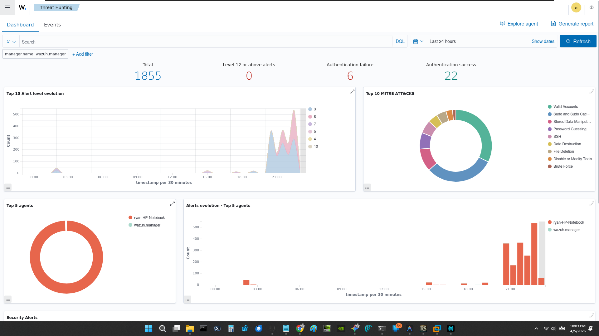

# Wazuh SOC Home Lab: Samba AD Honeytoken Detection Engineering

## Executive Summary

Built a production-representative SOC detection lab from scratch on a Tailscale mesh VPN,
deploying a Samba Active Directory domain controller (LABRANGE.LOCAL), a Wazuh single-node
SIEM stack, and a monitored Ubuntu endpoint instrumented with Sysmon for Linux. The objective
was to go beyond a generic SIEM deployment and produce real detection engineering artifacts:
custom PCRE2-based decoders, a multi-rule honeytoken tripwire chain, and a validated alert
pipeline that identifies unauthorized access to privileged bait accounts. The lab concluded
with a live adversary simulation from Kali that triggered a Level 15 critical alert in Wazuh
 --  with full source attribution -- proving the detection chain end-to-end.

---

## Logical Architecture

| Host               | OS                | Role                                         | Tailscale IP      | Local IP         |
| ------------------ | ----------------- | -------------------------------------------- | ----------------- | ---------------- |
| `os1-ad`           | Ubuntu 24.04      | Wazuh SIEM Manager (Docker, single-node)     | `100.81.156.19`   | `192.168.1.x`    |
| `os2-samba-ad-dc`  | Ubuntu 24.04      | Samba AD DC (`dc01` container) + Wazuh Agent | `100.69.203.36`   | `192.168.59.130` |
| `ryan-HP-Notebook` | Ubuntu            | Monitored endpoint, Wazuh Agent + Sysmon     | `100.x.x.x`       | --               |
| `kali`             | Kali Linux 2026.1 | Attacker / Red Team                          | `100.118.130.124` | --               |

All inter-host traffic routes over **Tailscale** (`100.x.x.x` subnet). No inbound ports are
exposed to the internet. The Samba DC runs as a Docker container (`diegogslomp/samba-ad-dc`)
with bind-mounted volumes for `/usr/local/samba/var` (logs) and `/usr/local/samba/etc`
(config), allowing the host-side Wazuh agent to tail Samba logs directly from the filesystem.

**Domain Structure -- `LABRANGE.LOCAL`**

```
DC=labrange,DC=local
└── OU=Corp
    ├── OU=IT          → j.henderson
    ├── OU=Finance     → m.torres
    ├── OU=HR          → a.patel
    └── OU=ServiceAccounts
        ├── svc-backup   [HONEYTOKEN - Domain Admins]
        └── adm-legacy   [HONEYTOKEN - Domain Admins]
```

---

## MITRE ATT&CK Coverage

| Rule ID  | Description                           | Tactic            | Technique | Level  |
| -------- | ------------------------------------- | ----------------- | --------- | ------ |
| `100050` | Sysmon Process Create (EventID 1)     | Execution         | T1059     | 3      |
| `100051` | Sysmon Network Connection (EventID 3) | C2 / Exfil        | T1071     | 3      |
| `100052` | Sysmon Process Terminate (EventID 5)  | Defense Evasion   | T1036     | 2      |
| `100060` | Samba auth event observed (base)      | Credential Access | --        | 3      |
| `100061` | Honeytoken `svc-backup` touched       | Credential Access | **T1078** | **15** |
| `100062` | Honeytoken `adm-legacy` touched       | Credential Access | **T1078** | **15** |
| `100063` | Samba auth failure (single)           | Credential Access | T1110     | 10     |
| `100064` | Repeated auth failures (>=5 in 60s)   | Credential Access | **T1110** | 12     |

---

## Phase 1: Endpoint Telemetry (Sysmon for Linux)

Deployed Sysmon for Linux on `ryan-HP-Notebook` to capture:

- **EventID 1** -- Process creation
- **EventID 3** -- Network connections
- **EventID 5** -- Process termination

**The Challenge:** Wazuh ships Sysmon decoders targeting Windows XML format. Linux Sysmon
emits a structurally different XML schema -- Wazuh's default decoders silently drop every
event. I engineered a custom decoder set (`local_decoder.xml`) and corresponding rules
(`local_rules.xml`, IDs `100050`–`100053`) to parse the Linux Sysmon XML schema and produce
structured Wazuh alerts.

```xml
<!-- Linux Sysmon decoder (excerpt) -->
<decoder name="sysmon-linux">
  <prematch>ProviderName=Microsoft-Windows-Sysmon</prematch>
</decoder>

<decoder name="sysmon-linux-eventid">
  <parent>sysmon-linux</parent>
  <regex type="pcre2">EventID>(\d+)</regex>
  <order>id</order>
</decoder>
```

```xml
<!-- Rule: Process Creation (EventID 1) -->
<rule id="100050" level="3">
  <decoded_as>sysmon-linux</decoded_as>
  <field name="id">^1$</field>
  <description>Sysmon Linux: Process created</description>
  <group>sysmon,process_creation,T1059</group>
</rule>
```

---

## Phase 2: Active Directory & Honeytoken Deployment

Deployed Samba AD on `os2-samba-ad-dc` using Docker Compose. After the container stabilized,
injected two highly-privileged bait accounts into `Domain Admins`:

```bash
# Honeytoken 1 - fake service account
docker exec dc01 samba-tool user create svc-backup 'Bkp$2019Legacy!' \
  --description="SVCACCT - Pwd Backup2019 - rotation pending..."
docker exec dc01 samba-tool group addmembers "Domain Admins" svc-backup

# Honeytoken 2 - fake legacy admin
docker exec dc01 samba-tool user create adm-legacy 'Legacydmin2017!' \
  --description="OLD ADMIN - do not delete - migration pending Q1"
docker exec dc01 samba-tool group addmembers "Domain Admins" adm-legacy
```

These accounts are intentionally designed to look like forgotten, high-value credentials.
Any authentication attempt against either account is, by definition, malicious -- no
legitimate process should ever use them.

**Audit Logging Configuration (`smb.conf`):**

```ini
[global]
  log level = 1 auth_audit:5
  log file = /usr/local/samba/var/log.samba
  max log size = 5000
```

Setting `auth_audit:5` forces Samba to write a structured `Auth:` line for every
authentication attempt -- success or failure -- into `log.samba`. The Wazuh agent on `os2`
tails both `log.samba` and `log.<attacker-ip>` via `ossec.conf` `<localfile>` blocks:

```xml
<localfile>
  <log_format>syslog</log_format>
  <location>/home/admin-rd/samba-ad/data/var/log.samba</location>
</localfile>
<localfile>
  <log_format>syslog</log_format>
  <location>/home/admin-rd/samba-ad/data/var/log.100.118.130.124</location>
</localfile>
```

---

## Phase 3: Custom Detection Engineering

### Decoders

Wrote PCRE2-based decoders in `/var/ossec/etc/decoders/local_decoder.xml` on the Wazuh
manager to parse the Samba `Auth:` log format.

```xml
<!-- Base Samba auth decoder -->
<decoder name="samba_auth">
  <prematch>Auth: [</prematch>
</decoder>

<!-- Extract authenticated username -->
<decoder name="samba_auth_user">
  <parent>samba_auth</parent>
  <regex type="pcre2">user \[(?:\w+)\\([^\]]+)\]</regex>
  <order>dstuser</order>
</decoder>

<!-- Kerberos variant -->
<decoder name="samba_auth_kerberos">
  <parent>samba_auth</parent>
  <regex type="pcre2">Kerberos.*?account\s+(\S+)</regex>
  <order>dstuser</order>
</decoder>
```

### Rules

```xml
<group name="samba_ad,">

  <!-- Base: any Samba auth event -->
  <rule id="100060" level="3">
    <decoded_as>samba_auth</decoded_as>
    <description>Samba AD Authentication event observed</description>
    <group>linux,samba,authentication</group>
  </rule>

  <!-- HONEYTOKEN: svc-backup touched -->
  <rule id="100061" level="15">
    <if_sid>100060</if_sid>
    <match>svc-backup</match>
    <description>HONEYTOKEN TRIPWIRE: svc-backup touched (T1078)</description>
    <group>honeytoken,credential_access,T1078,high_priority</group>
  </rule>

  <!-- HONEYTOKEN: adm-legacy touched -->
  <rule id="100062" level="15">
    <if_sid>100060</if_sid>
    <match>adm-legacy</match>
    <description>HONEYTOKEN TRIPWIRE: adm-legacy touched (T1078)</description>
    <group>honeytoken,credential_access,T1078,high_priority</group>
  </rule>

  <!-- Auth failure (spray/brute recon) -->
  <rule id="100063" level="10">
    <if_sid>100060</if_sid>
    <regex type="pcre2">NT_STATUS_WRONG_PASSWORD|NT_STATUS_NO_SUCH_USER|NT_STATUS_LOGON_FAILURE</regex>
    <description>Samba AD Auth failure - possible spray/brute force (T1110)</description>
    <group>linux,samba,authentication_failed,T1110</group>
  </rule>

  <!-- Brute force: 5+ failures from same source in 60s -->
  <rule id="100064" level="12">
    <if_sid>100063</if_sid>
    <same_source_ip />
    <timeframe>60</timeframe>
    <frequency>5</frequency>
    <description>Samba AD Repeated auth failures - brute force likely (T1110)</description>
    <group>linux,samba,bruteforce,T1110</group>
  </rule>

</group>
```

**Rule design rationale:**

- Rule `100060` is a low-noise base event (Level 3); it exists only as an anchor for
  child rules, keeping the alert queue clean during normal operations.
- Rules `100061` and `100062` fire at Level 15 (Wazuh's maximum severity) and set
  `mail: true`, ensuring immediate notification on any honeytoken interaction.
- Rule `100064` uses `<same_source_ip>` with a 60-second sliding window to catch
  credential spray patterns before they succeed.

---

## Phase 4: Attack Simulation & Validation

Executed the honeytoken tripwire from Kali using `smbclient` with the `svc-backup`
credential set:

```bash
# Executed from Kali (100.118.130.124)
smbclient //100.69.203.36/netlogon \
  -U 'LABRANGE\svc-backup%Bkp$2019Legacy!' \
  -c 'ls'
```

The Samba DC logged the authentication to `log.samba`. The Wazuh agent shipped the event
to the manager. The `samba_auth` decoder matched the `Auth: [` prefix, the `samba_auth_user`
decoder extracted `svc-backup` as `dstuser`, and rule `100061` fired.

**Resulting alert in `/var/ossec/logs/alerts/alerts.json`:**

```json
{
  "timestamp": "2026-04-07T23:58:28.945+0000",
  "rule": {
    "level": 15,
    "description": "HONEYTOKEN TRIPWIRE: svc-backup touched (T1078)",
    "id": "100061",
    "firedtimes": 1,
    "mail": true,
    "groups": ["samba_ad"]
  },
  "agent": {
    "id": "002",
    "name": "os2-samba-ad-dc",
    "ip": "100.69.203.36"
  },
  "full_log": "Auth: [SMB2,NTLMSSP] user [LABRANGE]\\[svc-backup] at [Tue, 07 Apr 2026 23:58:28 UTC]
               with [NTLMv2] status [NT_STATUS_OK] workstation [KALI]
               remote host [ipv4:100.118.130.124:55914]",
  "decoder": { "name": "samba_auth" },
  "location": "/home/admin-rd/samba-ad/data/var/log.samba"
}
```

The alert contains full attribution: attacker IP (`100.118.130.124`), workstation name
(`KALI`), authentication protocol (`NTLMv2`), and the exact honeytoken account accessed.
A real SOC analyst receiving this alert has everything needed to initiate containment without
additional log hunting.


**Live Wazuh Threat Hunting Dashboard -- captured during attack simulation:**



> 1,855 total events over 24 hours. 6 authentication failures. 22 successful authentications.
> The MITRE ATT&CK donut confirms T1078 (Valid Accounts) as the dominant tactic --
> matching the honeytoken tripwire firing at 21:58 UTC.

---

## Operational Notes & Troubleshooting Resolved

Several non-trivial infrastructure problems were diagnosed and resolved during the build:

- **LVM not extended at provisioning time:** `os2` launched with a 10 GB LV against an
  18.22 GB physical volume. Resolved with `lvextend -l +100%FREE` + online `resize2fs`.
- **Wazuh agent version mismatch:** `apt install wazuh-agent` resolved to `4.14.4-1`, which
  the `4.8.0` manager rejected at enrollment. Pinned to `wazuh-agent=4.8.0-1` to match the
  manager.
- **Samba log path discovery:** The `diegogslomp/samba-ad-dc` image places logs under
  `/usr/local/samba/var/`, not `/var/log/samba/` as most documentation assumes. Located via
  `docker inspect dc01 --format '{{range .Mounts}}{{.Source}} -> {{.Destination}}{{end}}'`.
- **`bind interfaces only` blocking Tailscale auth:** Removing `bind interfaces only` from
  `smb.conf` allowed Samba to accept NTLMv2 auth from the `100.x.x.x` Tailscale subnet.
- **ossec.conf corruption from tee appends:** Successive `tee -a` calls pushed content
  outside the closing `</ossec_config>` tag. Resolved with a Python script that strips
  everything from the last `</ossec_config>` onward and rewrites the file cleanly.

---

## Next Steps: Attack Campaigns

The environment is wired and validated. The following campaigns are queued:

**Campaign 1 -- Cryptominer Simulation (T1496, T1059.004)**

- Drop a fake miner binary on `ryan-HP-Notebook`
- Sysmon EventID 1 fires on process creation; EventID 3 fires on outbound pool connection
- Wazuh rules chain: process hash + network destination flagged
- Validates the Sysmon decoder pipeline under active attack conditions

**Campaign 2 -- Credential Spray (T1110.003)**

- Automated password spray against `LABRANGE\` accounts from Kali using `crackmapexec`
- Rule `100064` (frequency/timeframe brute-force detection) validated under real spray volume

**Campaign 3 -- Lateral Movement via Pass-the-Hash (T1550.002)**

- Dump NTLM hash from a compromised endpoint, relay to Samba DC
- Tests whether NTLMv2 relay traffic triggers `100060` base rule + any anomalous source

---

## Tech Stack

`Wazuh 4.8.0` `Samba AD DC 4.x` `Docker Compose` `Sysmon for Linux`
`Tailscale` `Ubuntu 24.04` `Kali Linux 2026.1` `PCRE2` `OpenSearch`
