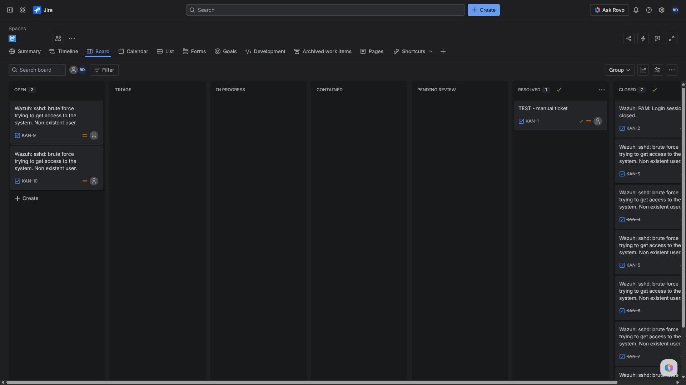
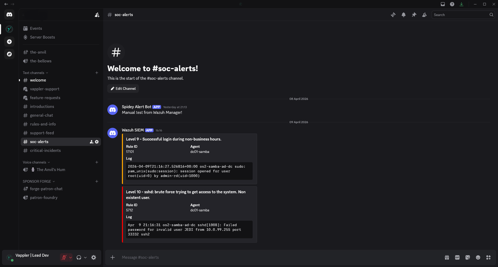

# Wazuh SOC Home Lab: Automated SIEM Ticketing and ChatOps Pipeline

## Executive Summary

Built the second phase of my Wazuh SOC home lab by extending the previously validated Samba AD detection environment into a full alert-to-analyst workflow.

The first lab proved I could generate high-fidelity detections from a monitored Active Directory environment. This project took the next operational step and wired the Wazuh manager into Jira for automated ticket creation and into Discord for real-time ChatOps alerting. The result is a production-representative escalation pipeline that moves detections out of the dashboard and into the places a SOC actually works from - queues, channels, triage boards, and tracked investigations.

This build was not about simply sending a webhook. The goal was to create a realistic analyst workflow that demonstrates detection engineering, escalation design, automation, and incident handling discipline in the same homelab environment.

---

## Logical Architecture

| Component | Platform | Role |
| --------- | -------- | ---- |
| `wazuh.manager` | Docker / Ubuntu | Central alert processing, rule evaluation, and integration dispatch |
| `wazuh.indexer` | Docker / Ubuntu | Event indexing and storage backend |
| `wazuh.dashboard` | Docker / Ubuntu | Analyst-facing dashboard and hunting interface |
| Samba AD source | Ubuntu / Samba AD | Security event source for authentication and access activity |
| Jira Cloud | SaaS | Automated incident and case tracking |
| Discord | SaaS | Real-time ChatOps notification and alert visibility |

The Wazuh stack runs as a single-node Docker deployment with persistent volumes for the manager, queue, logs, integrations, indexer data, dashboard state, and Filebeat storage. Integration-specific config is mounted directly into the manager container so the alerting workflow remains portable, reproducible, and easy to maintain as code.

---

## Escalation Model

The goal was not just "Wazuh sends a message somewhere." The goal was a realistic SOC escalation path.

| Workflow Need | Action | Destination |
| ------------- | ------ | ----------- |
| Immediate analyst visibility | Real-time security notification | Discord |
| Trackable investigation record | Automatic issue creation | Jira |
| High-confidence operational response | Alert visibility plus formal case artifact | Discord + Jira |

That separation matters. ChatOps gives speed and awareness. Ticketing gives accountability, workflow state, triage history, and a durable record of analyst action.

---

## Phase 1: Containerized SIEM Foundation

Deployed the Wazuh manager, indexer, and dashboard as Docker services on Ubuntu using Docker Compose, with persistent named volumes for the critical Wazuh and OpenSearch paths.

This kept the SIEM stack isolated from the host OS while preserving the same operational model used across the rest of the homelab - repeatable service startup, cleaner troubleshooting boundaries, and configuration that could be documented and rebuilt consistently.

**Infrastructure notes:**

- Persistent volumes back the manager configuration, queue, logs, integrations, active response, Filebeat state, indexer data, and dashboard data.
- Manager, indexer, and dashboard services remain split cleanly so analysis, storage, and presentation are decoupled.
- Integration config is mounted directly into the manager runtime, which made testing and iteration significantly faster during troubleshooting.

---

## Phase 2: ChatOps Engineering with Discord

Wazuh does not natively emit Discord-ready payloads. Discord expects a JSON embed structure, while Wazuh integrations are more generic. To bridge that gap, I engineered a custom Python integration that transforms raw Wazuh alert JSON into Discord-compatible webhook messages.

The custom integration solved several real engineering problems:

- Dynamic webhook URL discovery from runtime arguments so the integration would not break if Wazuh shifted parameter placement.
- Severity-based color coding so alert urgency is immediately visible inside the SOC channel.
- Schema translation from Wazuh's flat JSON structure into Discord's nested `embeds` payload format.
- Webhook normalization to strip incompatible `/slack` suffixes before delivery.

```python
#!/usr/bin/env python3
import sys, json, urllib.request

alertfile = sys.argv[1]
hookurl = next((arg for arg in sys.argv if arg.startswith("http")), None)

if hookurl and hookurl.endswith("/slack"):
    hookurl = hookurl[:-6]

with open(alertfile) as f:
    alert = json.load(f)

rule = alert.get("rule", {})
level = int(rule.get("level", 0))

color = 16711680 if level >= 10 else 16753920 if level >= 5 else 65280

payload = {
    "username": "Wazuh SIEM",
    "embeds": [
        {
            "title": f"Level {level} - {rule.get('description', 'Alert')}",
            "color": color,
        }
    ]
}
```

That made the ChatOps side operational instead of cosmetic. The end result was a live analyst-facing feed rather than a raw JSON dump.

---

## Phase 3: Ticketing Automation with Jira

On the ticketing side, the objective was to ensure that actionable alerts did not die in the dashboard. Higher-confidence detections were routed into Jira so they became tracked work items that could be reviewed, documented, escalated, and closed like real SOC investigations.

Each ticket captures the context needed to begin triage:

- Rule ID and alert level
- Description and alert groups
- Agent name and host context
- Source IP and source user where available
- Timestamp and raw log context
- Analyst checklist for review and closure

I also structured the Jira board to mirror a believable security workflow rather than default software-development statuses:

- OPEN
- TRIAGE
- IN PROGRESS
- CONTAINED
- PENDING REVIEW
- RESOLVED
- CLOSED

That matters because ticketing experience in security is not just opening an issue. It is being able to move an alert through triage, investigation, containment, review, and closure in a way that matches real incident handling.



---

## Phase 4: End-to-End Validation

After wiring the integrations, I validated the full pipeline against the existing homelab environment. Security-relevant events generated from the monitored stack flowed through Wazuh, triggered the integration layer, created a Jira artifact, and posted a live notification into Discord.

That was the point of the project. A good detection is valuable. A detection that reaches the analyst immediately, lands in the team's workflow, and produces a trackable case artifact is operational.



---

## Engineering Challenges Resolved

Several non-trivial problems had to be diagnosed and corrected during the build:

### Challenge 1 - Runtime argument shifting

**Symptom:** Manual tests against the Discord integration worked, but live execution from Wazuh failed.

**Root cause:** Wazuh passes multiple runtime arguments to custom integrations. The script initially trusted positional placement too rigidly and grabbed the wrong argument under live execution.

**Resolution:** Refactored the integration to search `sys.argv` dynamically for the actual webhook URL instead of assuming a fixed position.

### Challenge 2 - Component version drift

**Symptom:** Wazuh agent and manager compatibility issues appeared after host-side package updates.

**Root cause:** The manager stack was containerized and version-pinned independently from the host OS. That created agent-manager mismatch risk when other components updated faster than the SIEM runtime.

**Resolution:** Standardized the deployment around the containerized Wazuh stack and kept the integration work aligned with the manager's actual runtime version.

### Challenge 3 - Discord payload rejection

**Symptom:** Discord returned HTTP 400 and silently dropped live alerts.

**Root cause:** Discord webhook formatting is not Slack formatting. Minor endpoint and payload mismatches were enough to break delivery.

**Resolution:** Implemented webhook cleanup logic and built the payload specifically around Discord's native embed schema.

### Challenge 4 - Permissions and execution context

**Symptom:** Custom integrations can fail silently when ownership or execution mode is wrong inside the manager runtime.

**Root cause:** Wazuh integrations are sensitive to file mode, group ownership, and execution context.

**Resolution:** Locked the custom integration scripts down with the correct ownership and restrictive execution permissions so the manager could run them safely and consistently.

---

## Security Posture and Skills Demonstrated

This project demonstrates several skills that map directly to SOC and security engineering work:

- SIEM alert automation
- ChatOps alert routing
- Ticketing workflow design
- Custom Python integration development
- Webhook-based alert delivery
- REST API integration
- Dockerized SIEM operations
- JSON payload transformation
- Triage workflow engineering
- Troubleshooting across containers, integrations, and SaaS APIs

It also shows a critical operational skill: I did not stop at alert generation. I carried the homelab through the full analyst workflow layer, which is where many detection projects stop short.

---

## Files Included

Sanitized implementation artifacts are included in the `Files/` directory for reference:

- `ossec-4.conf`
- `custom-discord-2.py`

These are included as supporting implementation references for the integration layer documented in this project.

---

## Tech Stack

`Wazuh 4.14.4` `OpenSearch` `Docker Compose` `Python 3`
`Jira Cloud` `Discord Webhooks` `REST APIs` `Ubuntu Linux`
`Samba Active Directory` `JSON` `Webhook Integrations` `Detection Engineering`
