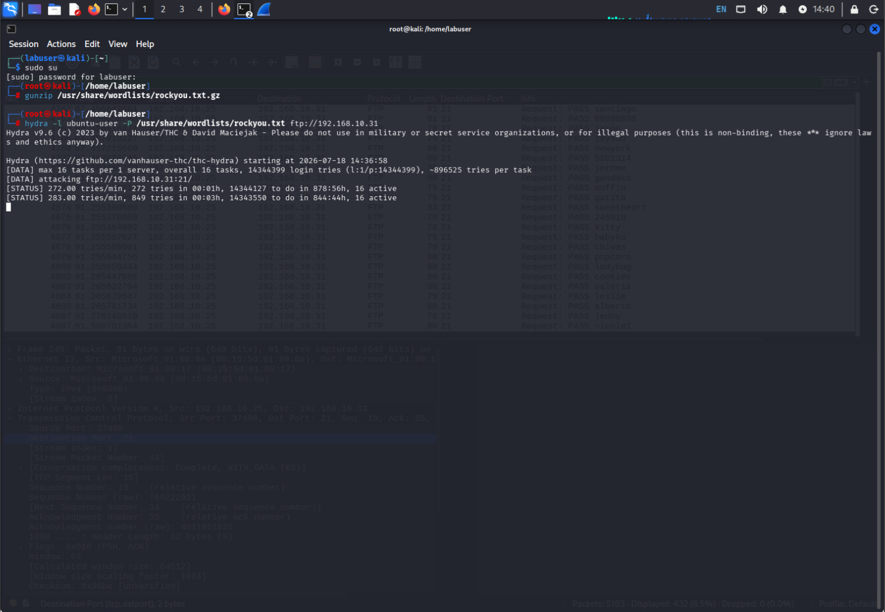
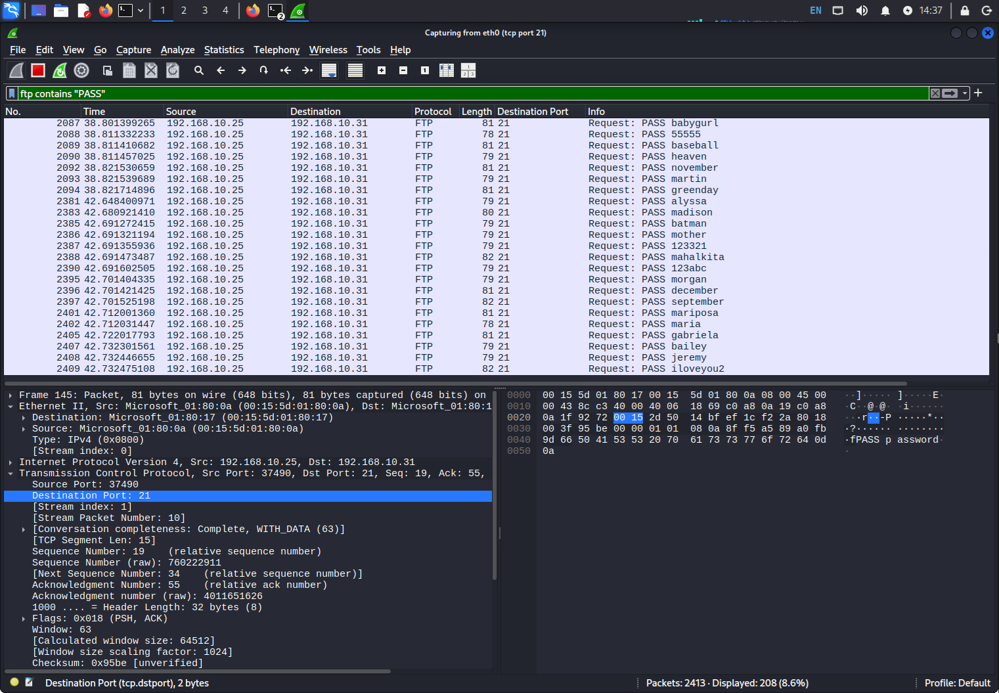

# Network Traffic Analysis: Plaintext Credential Harvesting & FTP Brute-Force Attacks

## Executive Summary

Three-part network security lab demonstrating how unencrypted protocols and weak credential policies get exploited in practice. Using Wireshark on Kali Linux, I intercepted plaintext FTP and HTTP traffic to prove that cleartext protocols expose credentials to anyone positioned on the network path, then escalated to a full Hydra dictionary brute-force attack against a live `vsftpd` server, correlating the attack tool's output directly against the packet capture to confirm every login attempt crossed the wire in the clear.

Unencrypted protocols are one of the most consistent red flags in real-world attack path analysis - threat actors don't need to defeat a hardened firewall when a service is broadcasting credentials in plaintext or accepting unlimited login attempts.

---

## Lab Environment

| Role          | Machine              | IP Address    | Credentials                |
| ------------- | --------------------- | ------------- | --------------------------- |
| Attacker      | Kali Linux             | 192.168.10.25 | labuser / Passw0rd!         |
| Target        | Ubuntu Server 20.04    | 192.168.10.31 | ubuntu-user / passw0rd!     |
| Capture Tool  | Wireshark              | --            | `eth0` interface            |

---

## Part 1: Capturing Plaintext FTP Credentials

Scoped a Wireshark capture to FTP control/data ports (`tcp port 20 or tcp port 21`), then triggered a real credential exchange against a public unencrypted FTP test server. The display filters `tcp contains "USER"` and `tcp contains "PASS"` isolated the exact packets carrying the login sequence.

**Finding:** The frame's ASCII payload decoded directly to `USER labuser\r\n` and `PASS Passw0rd!\r\n` - both transmitted with zero obfuscation. FTP's control channel has no encryption layer; a compromised switch, rogue AP, or ARP-spoofing attacker sees the exact credentials as they cross the wire.

## Part 2: HTTP Traffic Analysis and Encryption Verification

Generated unencrypted web traffic against an intentionally plaintext test site (`http://http.neverssl.com`) and confirmed the absence of TLS by inspecting the destination port. Traffic resolved to **port 80**, not 443 - had this been HTTPS, the payload would have been unreadable ciphertext instead of plaintext HTTP.

## Part 3: FTP Dictionary Brute-Force Attack

Deployed `vsftpd` on the Ubuntu target to stand up a live, deliberately weak login target, then launched Hydra from Kali against it using the RockYou wordlist (14.3 million breached passwords):

```bash
hydra -l ubuntu-user -P /usr/share/wordlists/rockyou.txt ftp://192.168.10.31
```



Hydra ran 16 concurrent worker tasks at ~280 attempts/minute. Wireshark captured the attack in parallel, filtered on `ftp contains "PASS"`, isolating 432 password-guess packets (8.5% of 5,103 total captured) - every single guess, including the literal string `password`, fully readable in plaintext.



---

## Concepts Covered

- Wireshark capture filters (`tcp port`) vs. display filters (`tcp contains`, `http.host`, `ftp contains`) - scoping traffic at capture time vs. analysis time
- FTP protocol structure - `USER`/`PASS` command exchange in cleartext
- Ethernet II frame inspection - extracting MAC addresses at Layer 2
- HTTP vs. HTTPS port verification (80 vs. 443) as an encryption litmus test
- `vsftpd` deployment and `systemctl`/`service` management
- Hydra dictionary attacks - `-l`/`-P` syntax, task concurrency, RockYou wordlist usage
- Correlating brute-force tool output with live packet captures for full attack-chain visibility

---

## Defensive Takeaways

Generic IT policy alone doesn't stop this class of attack - the fix has to be architectural. Legacy plaintext protocols like FTP and unencrypted HTTP need to be disabled outright, with connections forced onto encrypted equivalents (SFTP/FTPS, HTTPS) or dropped at the firewall. Account lockout thresholds and rate limiting are equally critical, since they stop tools like Hydra from ever completing a dictionary run regardless of how weak the underlying password is.

---

## Tech Stack

`Wireshark` `Hydra` `vsftpd` `Kali Linux` `Ubuntu Server 20.04` `RockYou Wordlist` `FTP` `HTTP`
