# Windows Group Policy: Account Lockout Hardening, Preference Deployment, Local Restrictions, and Logon/Logoff Scripting

## Executive Summary

A multi-part Active Directory Group Policy exercise spanning both domain-level and local GPO administration: scoping a dedicated OU and enforcing an account lockout policy against it, deploying a folder to client machines via Group Policy Preferences, building a local GPO that locks down Control Panel and the registry editor for standard users while leaving administrators untouched, and deploying network-based logon/logoff scripts from a Domain Controller - deliberately broken twice to systematically diagnose exactly how Windows fails when script paths and visibility settings are misconfigured.

Group Policy is one of the most powerful levers in a Windows domain, and also one of the easiest places to get quietly wrong. Every configuration below was verified against the client, not just the console - via `gpresult`, RSoP, File Explorer, and live sign-in testing - because a GPO that looks correct in the editor is not the same as a GPO confirmed applied.

---

## Lab Environment

| Role                | Machine                | Domain Context                  | Purpose                                        |
| ------------------- | ------------------------ | --------------------------------- | ------------------------------------------------- |
| Workstation         | W10-VM 1 / W10-ADMIN      | HEXELO domain + local accounts     | GPO target, local GPO testing, script execution     |
| Domain Controller   | WS2019-DC01_NC MailSRV    | HEXELO\Administrator                | Group Policy Management, script share host           |
| Organizational Unit | Win10Clients               | hexelo.com                          | Scoped container for domain-level GPO targeting        |
| Local Admin         | LabUser                    | Local Administrators group           | Control baseline (local policy should NOT apply)         |
| Local Standard User | LabUser2                   | Local standard user                  | Restriction target (local policy SHOULD apply)             |
| Domain User         | HEXELO\ADUser1              | Domain account                        | Logon/logoff script test subject                             |

---

## Part 0: Scoping the Target OU

Before any policy could be meaningfully tested, the target workstation needed to sit inside a dedicated OU rather than the default `Computers` container, so that domain-linked GPOs could be scoped narrowly instead of applying domain-wide. A `Win10Clients` OU was created under `hexelo.com`, and the `W10-ADMIN` computer object was moved into it via Active Directory Users and Computers.

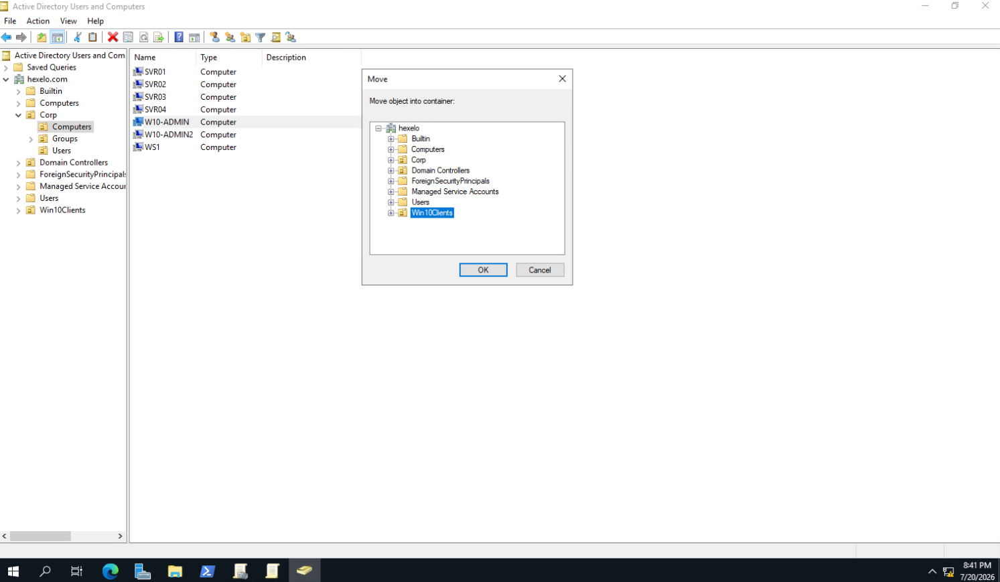

## Part 1: Domain GPO - Account Lockout Policy Enforcement

**Objective:** Enforce a domain-linked account lockout policy against the `Win10Clients` OU so that repeated invalid logon attempts trigger a temporary lockout - a baseline brute-force mitigation for any domain-joined endpoint.

Opened Group Policy Management from Server Manager's Tools menu and created a new GPO named `LabPolicy`, linked directly to the `Win10Clients` OU:

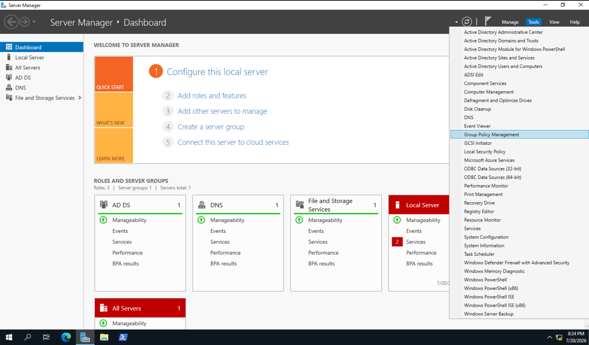
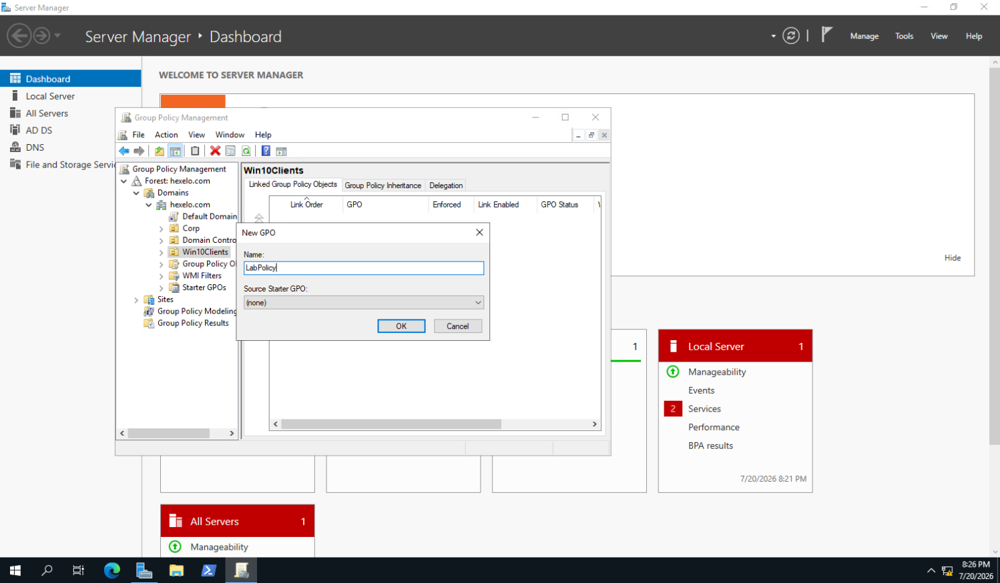

Configured the Account Lockout Policy under Computer Configuration > Windows Settings > Security Settings > Account Policies:

| Policy                                | Value                    |
| --------------------------------------- | -------------------------- |
| Account lockout threshold                | 3 invalid logon attempts     |
| Account lockout duration                  | 10 minutes                    |
| Reset account lockout counter after        | 10 minutes                      |
| Allow Administrator account lockout          | Enabled                           |

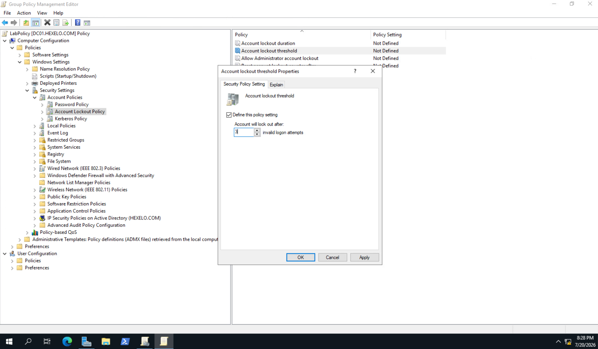

**Verification (double-checked, not assumed):** Ran `gpresult /r` directly on `W10-ADMIN` to confirm `LabPolicy` appeared in the client's applied Group Policy Objects list, then opened the Resultant Set of Policy (RSoP) snap-in to confirm the specific Account Lockout values were sourced from `LabPolicy` rather than the Default Domain Policy or a stale local setting:

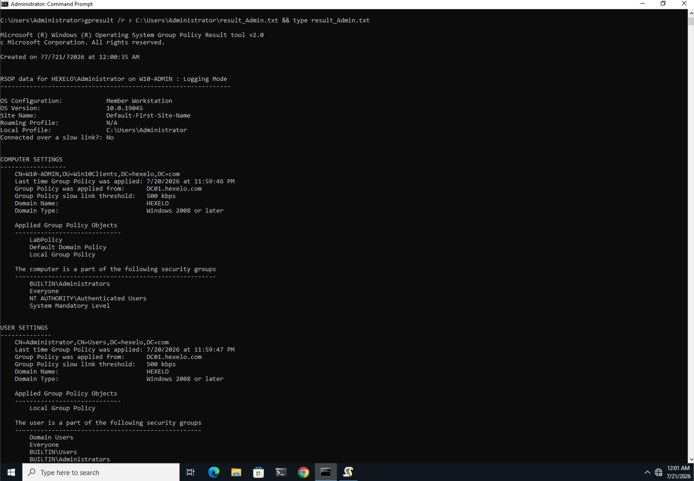
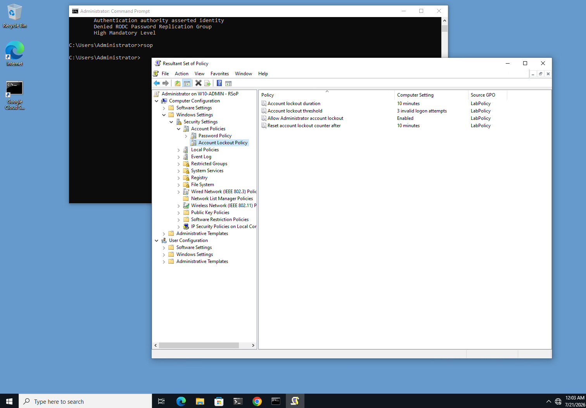

> **Key concept:** A policy set in the GPO editor is not the same as a policy confirmed applied. `gpresult` proves the GPO reached the client; RSoP proves *which* GPO actually won for each individual setting - critical when multiple linked GPOs could plausibly apply the same policy.

## Part 2: Domain GPO - Folder Deployment via Group Policy Preferences

**Objective:** Deploy a standard folder to every computer in scope using Group Policy Preferences (GPP), demonstrating environment provisioning through policy rather than manual per-machine configuration.

Added a Folders preference under User Configuration > Preferences > Windows Settings > Folders, configured to create `C:\BlueTest` with the Archive attribute set:

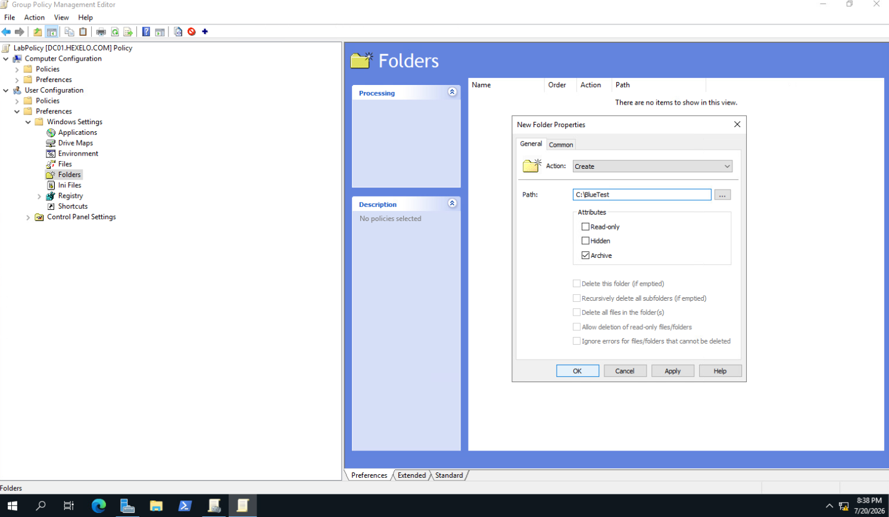

**Verification:** After policy refresh, confirmed `C:\BlueTest` existed in File Explorer on the target machine - proving the preference deployed and applied rather than merely appearing configured in the console.

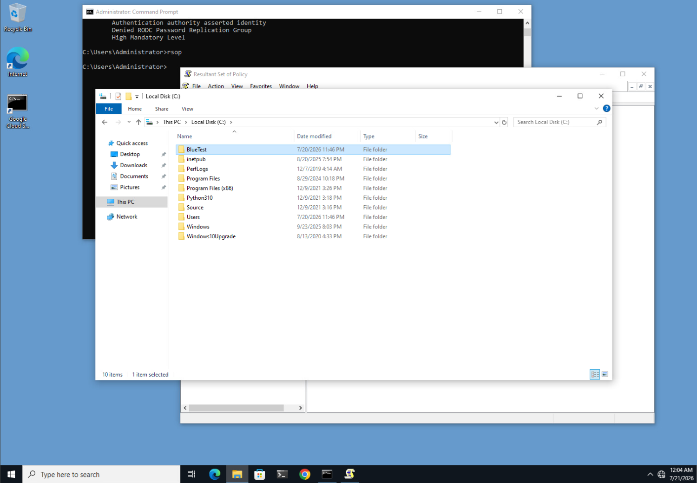

## Part 3: Local GPO - Restricting Non-Administrators

**Objective:** Lock down Control Panel and the registry editor for standard users on a single, non-domain-joined machine, while leaving local administrators unaffected.

Built a custom MMC console scoped specifically to the built-in **Non-Administrators** security group, rather than editing the default local policy that would affect every account including admins. Two Administrative Template policies were enabled under User Configuration:

| Policy Path                                   | Setting                                          | State   |
| ---------------------------------------------- | ------------------------------------------------- | ------- |
| Administrative Templates > Control Panel       | Prohibit access to Control Panel and PC settings  | Enabled |
| Administrative Templates > System               | Prevent access to registry editing tools           | Enabled |

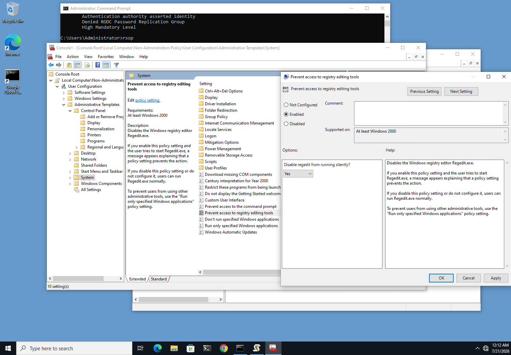
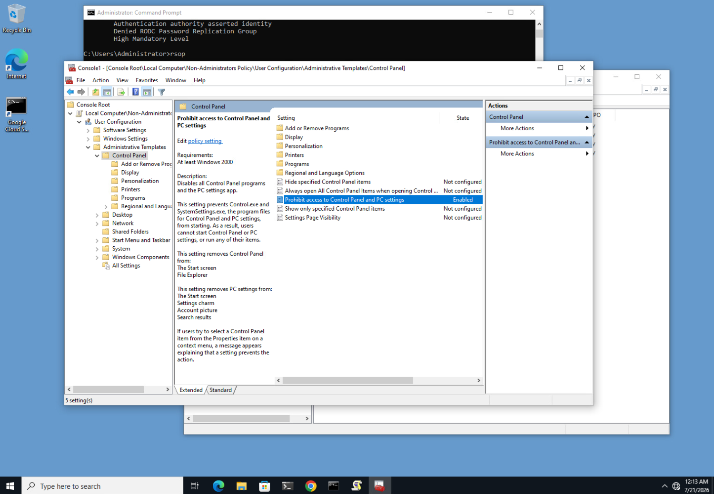

Provisioned the standard test account and applied the policy:

```cmd
gpupdate /force
net user LabUser2 Passw0rd! /ADD
```

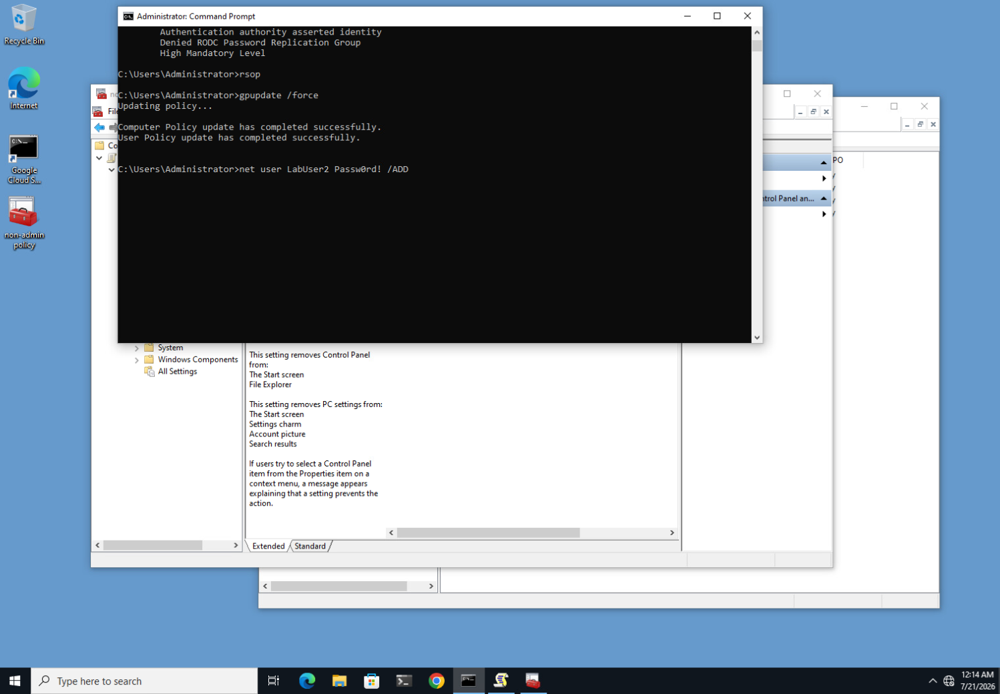

**Verification:** Signed in as `LabUser2` (standard user) and attempted `regedit`, Control Panel, and Settings:

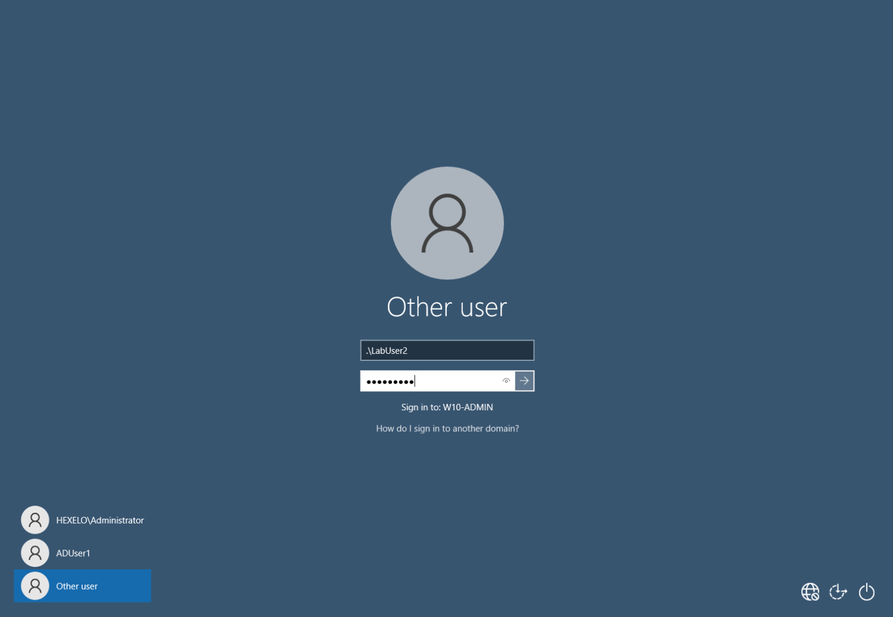
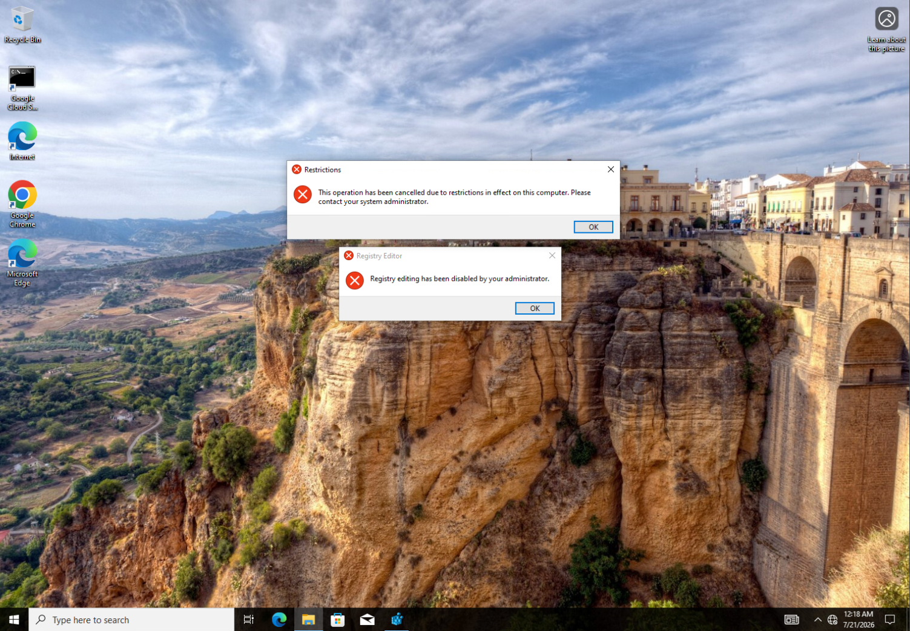

Both operations were blocked with the expected restriction dialogs. Signed in as `LabUser` (local admin), the same operations opened normally with no restriction - because the GPO was explicitly scoped to the Non-Administrators group rather than "Authenticated Users" or the default local policy, `LabUser`'s Administrators membership correctly excluded it from the restriction.

> **Key concept:** Scoping a local GPO to a specific security group filter - rather than editing the default local policy - is what makes differentiated enforcement possible on a single, non-domain-joined machine.

## Part 4: Logon/Logoff Scripts from the Domain Controller

Created a shared `scripts` folder on the DC and built `.cmd` wrapper files (`scriptlogon.cmd`, `scriptlogoff.cmd`) whose sole instruction is a UNC path to a corresponding `.txt` payload. Testing each script locally, in isolation, before wiring them into Group Policy confirmed that any future failure would live in the GPO deployment layer rather than in the scripts themselves.

Signed in as the domain test user, `HEXELO\ADUser1`, to validate the script against a real domain account rather than a local one:

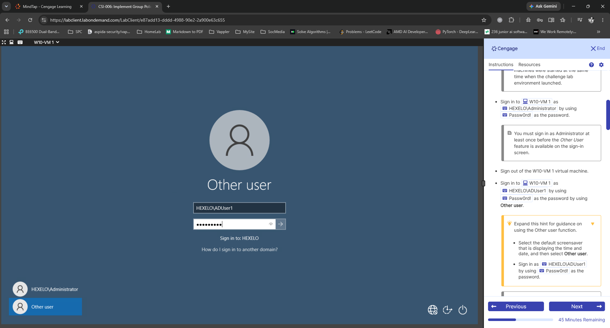

## Part 5: Deploying via GPO - Two Deliberate Failures and Two Fixes

This phase intentionally introduces two common Group Policy scripting mistakes, in order to observe exactly how Windows fails, before correcting each one.

**Failure 1 - Silent logoff failure.** The logoff script was configured with a local path (`C:\scripts\scriptlogoff.cmd`) that only existed on the Domain Controller, not the client. On logoff, Windows found nothing at that path on the client and failed the script silently, with no error dialog.

**Fix 1:** Corrected the script path to a UNC share (`\\DC01\scripts\scriptlogoff.cmd`), resolvable from any client regardless of where the file physically lives.

**Failure 2 - The hang.** With the path corrected, sign-out froze indefinitely on "Signing out..." with no error or progress, requiring a forced VM reset to recover.

**Diagnosis:** The path was correct, but Windows 10 hides logoff script execution windows by default. The script was actually running successfully in the background - with no visible window and no timeout configured, the sign-out sequence only *appeared* to hang.

**Fix 2:** Enabled **Display instructions in logoff scripts as they run** under Administrative Templates > System > Scripts, making script execution visible during testing instead of invisible.

**Final validation:** Sign-in ran the logon script visibly, and sign-out now visibly ran the logoff script to completion before the session closed cleanly - confirming both root causes were resolved.

## Part 6: Troubleshooting a Persistence Failure

After applying both fixes, validation initially still failed - indicating the corrected settings had not persisted to the GPO backing store on the Domain Controller. Remediation required removing any stale local-path script entry, re-adding the correct UNC path, re-confirming the visibility setting, and closing the Group Policy Management Editor before the values wrote correctly. This is a reminder that a setting shown as applied in the editor is not the same as a setting confirmed written to the policy store.

---

## Concepts Covered

- OU scoping - creating a dedicated `Win10Clients` OU and moving computer objects into it so domain GPOs apply narrowly, not domain-wide
- Domain-linked GPO creation and Account Lockout Policy enforcement (threshold, duration, counter reset)
- `gpresult /r` and the RSoP snap-in - verifying not just that a GPO applied, but which GPO won for a given setting
- Group Policy Preferences (GPP) - deploying folders to client machines through policy instead of manual provisioning
- Local GPO scoping via security group filtering (Non-Administrators) rather than editing the default local policy
- Administrative Templates - Control Panel and registry-editing restriction policies
- `gpupdate /force` - forcing immediate policy refresh without waiting for the background refresh interval
- `net user /ADD` - local account provisioning from the command line
- UNC path scripting (`\\host\share\script`) vs. local path scripting in GPO logon/logoff scripts
- Group Policy Management Console (domain-level) vs. local Group Policy Object Editor
- Silent script failure diagnosis - local path references breaking on remote clients
- Logoff script visibility and its effect on perceived sign-out hangs
- Systematic GPO remediation - removing and re-adding script entries when settings fail to persist

---

## Troubleshooting Takeaways

Group Policy scripting failures rarely throw a helpful error - they fail silently (wrong path) or appear to hang (hidden execution). The fix in both cases came down to two disciplines: always reference scripts by UNC path so every client can resolve them regardless of where the file physically lives, and enable script visibility during testing so failures are observable instead of invisible. More broadly, every configuration in this project - account lockout, folder deployment, local restrictions, and scripting - was confirmed against the client with `gpresult`, RSoP, File Explorer, or a live sign-in test, because a setting that looks applied in the editor is not the same as a setting confirmed live on the endpoint.

---

## Tech Stack

`Windows 10` `Windows Server 2019` `Active Directory Domain Services` `Group Policy Management Console` `Local Group Policy Object Editor` `Group Policy Preferences` `Administrative Templates` `RSoP` `gpresult` `MMC` `UNC Scripting`
