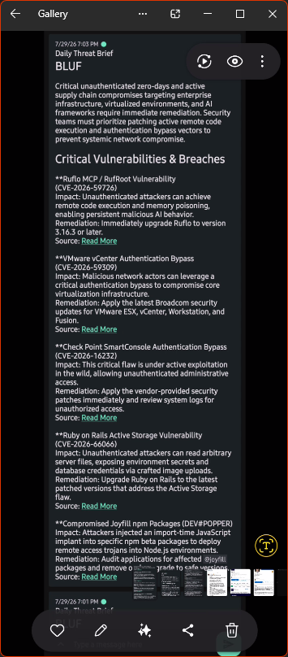

# Daily Threat Brief: Self-Hosted RSS-to-LLM Push Notification Pipeline

## Executive Summary

A self-hosted automation pipeline that pulls cybersecurity news from RSS feeds, summarizes it into an analyst-style morning brief using the Gemini API, and pushes that brief directly to a phone as a push notification. It runs on a Kali Linux laptop using a Python script, a virtual environment, and a systemd timer. No cloud automation platform, no subscription, and no third-party SaaS tool is involved in the pipeline - everything runs locally and costs nothing to operate.

The goal was a fast, low-effort way to stay current on active vulnerabilities, breaches, and threat actor activity every morning without manually checking several sites before coffee. It also served as a small, real-scope project to practice something that comes up constantly in detection engineering work: taking unstructured data, filtering it, transforming it through an LLM, and delivering the output somewhere useful.

This project intentionally documents the parts that did not work on the first attempt. The debugging process is as relevant to a security engineering role as the finished script - copying a working script off GitHub is easy; understanding why something breaks and how to fix it is the actual skill.

---

## What This Project Does

1. Pulls the last 24 hours of articles from three cybersecurity RSS feeds.
2. Feeds the collected headlines, summaries, and source links into the Gemini API with a strict analyst-style prompt.
3. Formats the output using Markdown so it renders cleanly on a phone.
4. Pushes the finished brief to a phone using `ntfy`, a free, open-source push notification service.
5. Runs automatically every morning at 6 AM using a systemd timer, with no manual trigger required.

---

## Live Output

<div align="center">



<br/>

<sub><i>The finished brief exactly as it lands on the phone each morning: a Bottom Line Up Front summary followed by ranked vulnerabilities and breaches, each with impact, remediation, and a source link - generated and delivered with zero manual steps.</i></sub>

</div>

---

## Environment

| Component      | Detail                                                              |
| --------------- | ---------------------------------------------------------------------- |
| Host            | Kali Linux, HP 15 laptop                                                  |
| Runtime         | Python 3.13, virtual environment                                            |
| Scheduling      | systemd service + timer (`Persistent=true`)                                  |
| LLM             | Gemini API (`gemini-3.5-flash-lite`), via the `google-genai` SDK                 |
| Notification    | `ntfy.sh` (public relay), Markdown-rendered push to phone                          |
| Sources         | The Hacker News, Dark Reading, Krebs on Security (RSS)                              |

---

## Why This Architecture

Three approaches were considered before settling on the final design.

**No-code automation platform (Make.com / Zapier):** ruled out. These platforms charge per operation past a small free tier and introduce a third party into a pipeline that would otherwise be entirely self-controlled. Given an existing homelab and daily Python usage for other projects, adding a SaaS dependency for something this simple didn't make sense.

**Google Sheets + Apps Script:** a legitimate free option, but it means writing and debugging JavaScript inside a spreadsheet environment with no real benefit over a script that can be run and version-controlled directly.

**Plain Python + systemd (chosen):** kept the entire pipeline in a language and environment already used daily, gave full visibility into every step through logging, and costs nothing to run since both the Gemini free tier and ntfy's public relay are free.

systemd timers were chosen over a standard cron job specifically because cron assumes the machine is always powered on and awake at the trigger time. Since this runs on a laptop that gets closed and moved around, a systemd timer with `Persistent=true` is more reliable - it catches up and runs the job as soon as the machine wakes, if it missed the scheduled time.

---

## Architecture

```
RSS Feeds (Hacker News, Dark Reading, Krebs on Security)
        |
        v
feedparser + requests   (fetch and filter articles from the last 24 hours)
        |
        v
Gemini API (gemini-3.5-flash-lite)   (summarize into analyst brief)
        |
        v
ntfy.sh   (push notification to phone, Markdown rendered)
        |
        v
systemd timer   (triggers the whole pipeline daily at 6 AM)
```

---

## The Script

The full script is in [`daily-threat-brief.py`](./daily-threat-brief.py). It is broken into four functions plus a `main()` orchestrator:

- **`pull_recent_articles()`** fetches each RSS feed manually using `requests`, then hands the raw bytes to `feedparser`. This matters because one source feed (Krebs on Security) sends the wrong `Content-Type` header, and `feedparser` rejects a URL fetched directly with the wrong header even though the underlying XML is valid. Fetching the bytes directly sidesteps that check entirely.
- **`build_prompt()`** wraps the collected articles in a strict prompt template that forces a Bottom Line Up Front summary, a maximum of five ranked vulnerabilities with impact and remediation, bolded CVEs and threat actor names, and Markdown-formatted source links.
- **`summarize_with_gemini()`** sends that prompt to the Gemini API using the current `google-genai` client and returns the plain text response.
- **`push_to_phone()`** sends the finished brief to `ntfy` with a `Markdown: yes` header so it renders with real bold text, headers, and tappable links instead of raw asterisks.
- **`main()`** ties the pipeline together and skips the Gemini call entirely if no new articles were found, avoiding wasted API quota on empty runs.

Every network call is wrapped in a try/except block that logs failures and continues rather than crashing, since this script runs unattended with no one present to catch an exception if a feed goes down at 6 AM.

---

## Troubleshooting Log

Each real issue encountered during the build, documented in the order it was hit, because the debugging process says more about actual skill level than a clean finished script would on its own.

### 1. Shell mismatch when setting the environment variable

**What happened:** The Gemini API key export line was appended to `~/.bashrc`, and `source ~/.bashrc` threw a wall of errors: `shopt: command not found`, `complete: command not found`, and a garbled prompt string.

**Why it happened:** Kali Linux has defaulted to the zsh shell since 2020. `shopt` and `complete` are bash-only built-ins that don't exist in zsh, so sourcing a bash config file from a zsh session throws errors for every bash-specific line it encounters.

**Fix:** Confirmed the active shell with `echo $SHELL` (zsh), and re-added the export line to `~/.zshrc` instead. Sourcing that file loaded the variable correctly with no errors.

### 2. Multiple typos introduced during manual editing

**What happened:** After several rounds of editing the script in `nano`, it failed with `NameError: name 'FEEDS' is not defined`.

**Why it happened:** A variable had been typed as `Feeds` instead of `FEEDS` in one part of the file. Python is case-sensitive, so this created two separate names instead of one. Further inspection also turned up a `-` used in place of `=` in two assignment statements, and a `**` used in place of `*` when unpacking a tuple into `datetime.datetime()`.

**Fix:** Ran `cat -n brief.py` for numbered output, manually reviewed every line, and corrected each mismatch. This is also why `python3 -m py_compile brief.py` now runs before every real execution - it catches syntax errors before wasting a Gemini API call on a script that won't even run.

### 3. Deprecated Gemini SDK

**What happened:** The script ran, but threw a `FutureWarning` stating that the `google.generativeai` package had reached end of life.

**Why it happened:** Google fully deprecated that SDK and replaced it with a unified `google-genai` package covering Gemini, Imagen, and Veo under one client interface.

**Fix:** Uninstalled `google-generativeai`, installed `google-genai`, and rewrote the API call from the old `genai.configure()` / `GenerativeModel()` pattern to the new `genai.Client()` / `client.models.generate_content()` pattern.

### 4. Gemini model retirement

**What happened:** The script returned a `404 NOT_FOUND` error stating that `gemini-2.5-flash` was no longer available to new users.

**Why it happened:** Google retired that model entirely in mid-2026 as part of its normal model lifecycle - not a configuration mistake, just model availability rotating on a schedule outside a developer's control.

**Fix:** Swapped the model string to a currently supported lightweight model. A one-line change, but it reinforced never hardcoding a model name as a long-term assumption.

### 5. Malformed and mislabeled RSS feeds

**What happened:** Two of three source feeds threw warnings on every run. Dark Reading's feed returned a "not well-formed, invalid token" XML error. Krebs on Security's feed was rejected outright with a "not an XML media type" error.

**Why it happened:** Dark Reading's older RSS endpoint (`/rss/all.xml`) has known formatting issues and has since been replaced by a cleaner canonical URL. Krebs's server sends a `Content-Type: text/html` header on a feed that is actually valid XML, and `feedparser` refuses to parse a URL-fetched feed with a mismatched content type as a safety check.

**Fix:** Swapped the Dark Reading URL to the current canonical feed. For Krebs, the fetch method changed entirely: instead of letting `feedparser` fetch the URL directly, the raw response is fetched with `requests` first, then the raw bytes are passed into `feedparser.parse()`. This bypasses the content-type check since `feedparser` is no longer making the HTTP request itself.

### 6. Tab and space mismatch

**What happened:** After adding a new line to capture article source links, the script failed with `TabError: inconsistent use of tabs and spaces in indentation`.

**Why it happened:** A line pasted into `nano` inserted a tab character while the rest of the file used spaces. Python requires consistent whitespace within a code block and won't silently normalize a mix of the two.

**Fix:** Ran `sed -i 's/\t/    /g' brief.py` to convert every tab character in the file to four spaces in one pass, resolving the mismatch across the whole script instead of hunting for the one bad line manually.

### 7. Deprecated datetime method

**What happened:** The script ran successfully but threw a `DeprecationWarning` for `datetime.datetime.utcnow()`.

**Why it happened:** Python is phasing out naive (non-timezone-aware) datetime handling in favor of explicit timezone-aware objects, to prevent a class of bugs where a naive UTC time gets silently misread as local time somewhere downstream.

**Fix:** Replaced `datetime.datetime.utcnow()` with `datetime.datetime.now(datetime.timezone.utc)`, and updated the corresponding datetime construction from parsed RSS timestamps to explicitly attach `tzinfo=datetime.timezone.utc`, since Python won't allow comparing a naive datetime against an aware one.

### 8. Unformatted output on the phone

**What happened:** The first successful brief arrived on the phone, but displayed raw Markdown syntax - bold text showed as literal double asterisks, and headers showed as literal pound signs.

**Why it happened:** ntfy's Android app only renders Markdown formatting when a message is sent with a `Markdown: yes` HTTP header attached. Without that header, it treats every message as plain text by default, regardless of app version or in-app settings.

**Fix:** Added `"Markdown": "yes"` to the headers dictionary in `push_to_phone()`. No app-side setting needed to change, since this is controlled entirely by the sender.

### 9. Missing source links

**What happened:** The first few working briefs summarized the news correctly but never included a link back to the original article.

**Why it happened:** The original RSS-parsing function only captured the title and summary fields from each feed entry. The link field was never collected in the first place, so Gemini had nothing to reference even with an explicit instruction to include sources.

**Fix:** Updated the article collection step to also pull `entry.get("link")` and append it to each collected item, then updated the prompt template to explicitly instruct Gemini to format each source as a Markdown link so it renders as a tappable "Read More" link instead of a raw URL string.

### 10. Exposed API key rotation

**What happened:** A live Gemini API key was exposed inside a chat session while troubleshooting.

**Why it happened:** A normal risk when pasting terminal output for debugging help - environment variables and config files often get pasted alongside legitimate error output without a second thought.

**Fix:** Deleted and regenerated the exposed key in Google AI Studio, then updated both the local shell environment variable and the `Environment=` line inside the systemd service file to reflect the new key. This also surfaced that editing a systemd unit file on disk does not take effect until `sudo systemctl daemon-reload` is run, since systemd caches parsed unit files in memory separately from the files on disk.

### 11. New key format authentication failure

**What happened:** After rotating the key, one run returned `401 UNAUTHENTICATED` with a specific `ACCESS_TOKEN_TYPE_UNSUPPORTED` reason.

**Why it happened:** Google has begun issuing a newer API key format (prefixed `AQ.` instead of the legacy `AIza` prefix), and this newer format was being intermittently rejected by the same endpoint that accepts the older format - confirmed as an active, widely reported issue rather than something specific to this setup.

**Fix:** Regenerated the key again, confirmed it worked correctly through a direct terminal test before touching the systemd service file, then updated the service file only after the key was confirmed working standalone - a reminder to always isolate a suspected environment/auth issue in the simplest possible context before assuming the automation layer is broken.

---

## Lessons From This Project

The actual code in this pipeline is short - four functions and a main loop. What made it worth documenting was everything around the code: shell environment quirks specific to Kali's zsh default, a live SDK deprecation mid-build, a model getting retired by the vendor during active use, inconsistent RSS server behavior across different publishers, and a real API key exposure that had to be rotated correctly across both a shell environment and a systemd unit file.

None of these are exotic problems. They are the exact kind of small, tedious, real-world friction that shows up constantly in detection engineering and security tooling work, where data sources, APIs, and delivery mechanisms that were never designed to talk to each other cleanly get glued together. Methodically isolating, diagnosing, and fixing each one in order, without losing track of what changed and why, is the actual point of this project.

---

## Setup Instructions

1. Clone this repository and `cd` into it.
2. Create a virtual environment: `python3 -m venv venv && source venv/bin/activate`
3. Install dependencies: `pip install feedparser requests google-genai`
4. Get a free Gemini API key from Google AI Studio and export it as `GEMINI_API_KEY` in your shell config (`~/.zshrc` or `~/.bashrc`, whichever your shell actually reads).
5. Install the ntfy app on your phone and subscribe to a unique, unguessable topic name.
6. Export your topic name as `NTFY_TOPIC` in your shell config (falls back to a placeholder if unset).
7. Test manually: `python3 daily-threat-brief.py` and confirm a notification arrives.
8. Copy the provided [`threat-brief.service`](./threat-brief.service) and [`threat-brief.timer`](./threat-brief.timer) templates into `/etc/systemd/system/`, update the paths and API key/topic to match your environment, then run:
   ```bash
   sudo systemctl daemon-reload
   sudo systemctl enable --now threat-brief.timer
   ```

---

## Concepts Covered

- RSS/XML parsing with `feedparser`, including working around malformed feeds and mismatched `Content-Type` headers
- LLM prompt engineering for structured, analyst-style output (BLUF format, ranked findings, enforced Markdown structure)
- `google-genai` SDK usage and migrating off a deprecated SDK mid-project
- Push notification delivery via `ntfy`, including Markdown rendering requirements
- systemd service + timer units for reliable, laptop-friendly scheduling (`Persistent=true` vs. cron)
- Credential hygiene - recognizing and remediating an exposed API key across both shell environment and systemd unit files
- Defensive scripting for unattended jobs - try/except wrapping per network call, skipping LLM calls on empty input to conserve quota
- Systematic troubleshooting across shell environment quirks, vendor SDK/model deprecations, and whitespace/syntax errors

---

## Disclaimer

The RSS feed URLs and model names referenced in this project are accurate as of mid-2026. RSS endpoints and LLM model availability both change over time at the discretion of the source providers. Anyone reusing this project should verify current feed URLs and model names before deploying. The `ntfy` topic and API keys in this repository are placeholders; each deployment should use its own unique, unguessable topic name and freshly generated key.

---

## Tech Stack

`Python 3.13` `feedparser` `requests` `google-genai` (Gemini API) `ntfy` `systemd` (service + timer) `Kali Linux`
