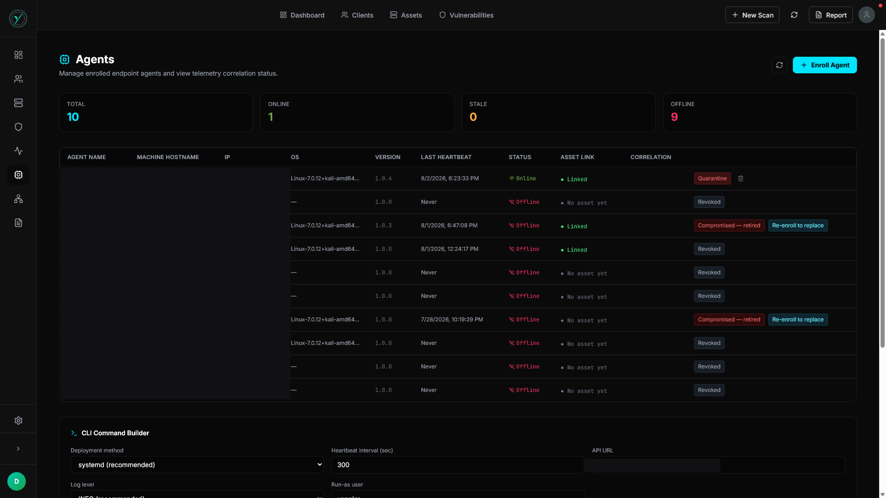

# Diagnosing a Self-Inflicted Agent Compromise in a Token-Rotation Auth Scheme

### An Incident Response & Root Cause Case Study

**Role:** Backend/Security Engineer (Contributing Developer)
**Systems Touched:** Flask REST API, PostgreSQL-backed rotation/audit logic, systemd-managed Linux daemon, Tailscale mesh networking
**Environment:** Physical Kali Linux endpoint (home lab), bridged to an internal Flask API over a Tailscale mesh network

---

## Executive Summary

This case study documents a production incident I diagnosed and fixed in an internal vulnerability management platform's endpoint agent - the lightweight daemon that runs on enrolled machines and reports back to the central platform over a rotating-token authentication scheme. A healthy, fully patched agent on a physical Linux endpoint in my home lab got permanently marked as compromised after nothing more than a single dropped network response. No attacker touched it. The system did that to itself.

I traced the failure back through the actual audit trail instead of guessing, found the real interaction between two pieces of code that were each individually reasonable, and designed a fix. My first instinct for the fix was wrong, and I want to be honest about that here, because catching it before it shipped is the part I'm actually proud of. The corrected fix went through a full TDD cycle, passed a live-integration reproduction of the exact incident, and is now running in production on my own lab hardware.

This isn't a lab exercise. This happened on infrastructure I run, to software I'm building, and I found and fixed it myself.

---

## 1. Background and System Context

The platform runs a small fleet of endpoint agents that authenticate to a central Flask API backed by PostgreSQL. Agents enroll once with a short-lived enrollment token, exchange it for an operational token, and then rotate that operational token on every heartbeat. The rotation is the security control - if an agent ever presents a stale, already-rotated token, the server treats that as a possible replay attack.

```
            ┌─────────────────────────────┐
            │   Backend API (Flask)        │
            │   internal Tailscale mesh    │
            └───────────────┬───────────────┘
                            │
              heartbeat every 300s,
              token rotates on every call
                            │
            ┌───────────────▼───────────────┐
            │   PostgreSQL                    │
            │   token-rotation function        │
            │   agent audit log table           │
            └───────────────┬───────────────────┘
                            │
              suspend (403) on stale rotation
              compromise (401) on second strike
                            │
            ┌───────────────▼───────────────────┐
            │   Endpoint agent                    │
            │   systemd service, Restart=on-failure │
            │   RestartSec=30                        │
            └────────────────────────────────────────┘
```

The agent itself is a Python daemon, distributed as a signed binary, installed as a systemd service with a hardened unit file (`NoNewPrivileges`, `ProtectSystem=strict`, `PrivateTmp`, `ProtectHome`).

---

## 2. The Incident

I had just enrolled a fresh agent, watching the log in real time. For the first forty minutes it looked exactly like it should - a clean token rotation roughly every five minutes. Then, on one heartbeat, the connection to the backend timed out:

```
[AGENT] WARNING Heartbeat request failed: Read timed out (timeout=30)
[AGENT] ERROR   Agent suspended pending admin review (403). Exiting.
[AGENT] ERROR   Agent marked compromised (401) - re-enrollment required. Exiting.
[AGENT] ERROR   Agent token rejected (401). Exiting.
```

And then it just kept dying and restarting. By the time I noticed and manually stopped the service, the restart counter had climbed past 200.

---

## 3. Root Cause Analysis

I didn't want to guess at this from the symptoms, so I went straight to the agent's audit log table and reconstructed the actual sequence of events for that agent record.

What I found:

- A long run of clean token-rotation events, one every roughly 300 seconds.
- A **stale-restart** event, logged with a delta of roughly 289 seconds since the last confirmed rotation - just outside the server's 120-second grace window, so it correctly suspended the agent.
- A **reuse-detected** event about 31 seconds later, which escalated the agent straight to compromised.

That 31-second gap was the giveaway. It matched the systemd unit's `RestartSec=30` almost exactly. The daemon wasn't being attacked - it was crashing on the 403 and getting relaunched by its own supervisor with the same stale token, which the server correctly flagged as a second stale presentation of a suspended credential.

Two things had to be true at once for this to happen:

**On the server**, the token-rotation function has a 120-second grace window before treating a missed rotation as suspicious. That's a reasonable design, but the agent's own heartbeat interval is 300 seconds by default. Any single lost response - a timeout, a dropped connection - will always land past that grace window, because the client's next scheduled attempt is structurally slower than the window meant to forgive it.

**On the client**, the heartbeat handler had no distinction between a clean rejection and an ambiguous outcome. On any 403 it just logged an error and exited:

```python
if response.status_code == 403:
    log.error("Agent suspended pending admin review (403). Exiting.")
    sys.exit(1)
```

Neither piece of code is wrong by itself. The 120-second grace window is a sane replay defense. Exiting on a rejected token is a sane default. Put them together with a systemd unit that restarts the process every 30 seconds, and a single dropped network response turns into a permanent, self-inflicted compromise inside about a minute - with zero attacker involvement.

I confirmed this wasn't a repeat of an earlier, unrelated bug from before self-rotation existed at all. This agent was running the intended rotation logic exactly as designed. The bug lived entirely in how two individually-correct pieces of design interacted under a realistic network hiccup.

---

## 4. The Fix I Almost Shipped (and Why I Didn't)

My first idea was simple: on a 403, don't exit - just back off for a bit and retry with the same token.

Before I let that get implemented, I went back and actually read the live definition of the suspended branch inside the rotation function:

```sql
IF v_agent.suspended THEN
    -- any subsequent presentation while suspended escalates
    UPDATE agents SET compromised = true, ...
    RETURN jsonb_build_object('status', 'compromised');
END IF;
```

That branch doesn't care how long you waited. It fires on the next presentation, period. A timed backoff would not have prevented the escalation - it would have just delayed it by however many seconds I picked, while looking like it worked in a quick test. Given that a person noticing a suspended agent and pushing a new token realistically takes minutes to hours, there was no backoff duration short enough to be useful and long enough to actually avoid the second strike. I would have shipped something that felt like a fix and wasn't.

---

## 5. The Actual Fix

Two changes, both entirely client-side. I didn't touch the server's grace window, the heartbeat interval, or the escalation logic at all, on purpose. The whole point was to fix the daemon's behavior without loosening the actual security control.

**First, fast retry on ambiguous outcomes.** If a heartbeat fails with a timeout or connection error - meaning the daemon genuinely doesn't know whether the server processed the rotation - it now retries quickly, a few bounded attempts within seconds, instead of waiting for the next full 300-second cycle. That keeps a single lost response comfortably inside the server's existing 120-second grace window instead of blowing past it.

**Second, stop presenting the token on a real 403, without dying.** If the agent does get suspended, it stops calling the heartbeat endpoint entirely and sits in a paused state, logging clearly, waiting for a human to clear the suspension and push a fresh token. It does not exit. It does not let systemd relaunch it into the same trap.

```python
FAST_RETRY_ATTEMPTS = 3
FAST_RETRY_INTERVAL = 5  # seconds, stays well inside the 120s server grace window

def send_heartbeat(self):
    for attempt in range(FAST_RETRY_ATTEMPTS):
        try:
            response = self._post_heartbeat()
            break
        except (Timeout, ConnectionError):
            if attempt < FAST_RETRY_ATTEMPTS - 1:
                time.sleep(FAST_RETRY_INTERVAL)
                continue
            log.warning("Heartbeat ambiguous after retries, resuming normal interval.")
            return
    else:
        return

    if response.status_code == 403:
        log.error("Agent suspended pending admin review. Pausing heartbeats, not exiting.")
        self.suspended = True
        return

    if response.status_code == 401:
        log.error("Agent marked compromised. Re-enrollment required. Exiting.")
        sys.exit(1)
```

The important line in that whole thing is the difference between the 403 and 401 branches. 403 pauses and waits for a person. 401 is genuinely terminal and still exits, because that state actually does require re-enrollment and pretending otherwise would be wrong.

---

## 6. Testing

I run everything here through a TDD cycle, red then green, and this was no exception.

**Red:** wrote new tests against the unmodified agent code, confirmed they failed for the right reasons - missing constants, still exiting on 403, no retry loop at all.

**Green:** implemented the fix; the full modified test module passed.

**Live reproduction:** wrote an integration test that runs against a real local instance of the backend stack and replays the exact ambiguous-timeout sequence from the incident. It confirmed the agent self-heals and never reaches suspended or compromised.

**Regression check on the security control itself:** a separate test confirmed the actual replay backstop still works, completely unmodified, byte-for-byte the same code as before. That mattered to me - I didn't want to fix a false positive by accidentally weakening the real detection.

**Full backend suite after the fix:** all tests passing, zero failures, zero regressions.

---

## 7. Verification in Production

This is the part that makes this more than a diagnosis. I merged the fix, had a new build cut, and re-enrolled the test agent on it.

<p align="center">
  
</p>
<p align="center"><sub><i>The fleet dashboard post-fix - re-enrolled agent online and linked, prior compromised/revoked identities visible in the same view for comparison. Host and network identifiers redacted.</i></sub></p>

The Agents dashboard confirms the re-enrolled agent online and linked, with a confirmed correlation event against a live scan. It's running right now, on my own hardware, on the fix I designed.

---

## 8. Lessons Learned

The bug was never really about tokens or timeouts. It was about what happens when two components that are each individually correct get chained together without anyone checking what the combination actually does under a realistic failure. The grace window made sense. Exiting on a rejected token made sense. Neither engineer - and in this case that was me on different days - was wrong in isolation.

The part I actually want to remember from this is catching my own first fix before it shipped. It's easy to feel like you've solved something the moment you have an idea that sounds right. Going back and checking the idea against the actual behavior of the system, not the intent of the system, is what turned a plausible fix into a real one.

**24+ Hour Production Verification:** the fixed build ran continuously with zero suspend or compromise events across more than 24 hours of uptime and roughly 300 successful heartbeat rotations. The prior build reliably failed within one to two hours under identical network conditions on the same hardware. That contrast is the real evidence here - enrollment was never the part that was broken.

I have not yet deliberately reproduced the exact ambiguous-timeout condition on the fixed build to watch the fast-retry path trigger in real time. Sustained clean uptime is strong evidence the fix holds under normal conditions, but the more rigorous confirmation would be forcing a dropped heartbeat response on purpose - for example by briefly killing the network connection mid-heartbeat - and watching the agent self-heal instead of escalating. I'm treating that as the next verification step rather than closing this out purely on uptime.

---

*All hostnames, IP addresses, internal endpoint paths, table/function names, and other architectural details in this document have been redacted or generalized, and the screenshot above has host and network identifiers blacked out. Nothing in this write-up describes exploitable internals of any production system.*

---

## Tech Stack

`Python` `Flask` `PostgreSQL` `systemd` `Tailscale` `pytest` `Git`
