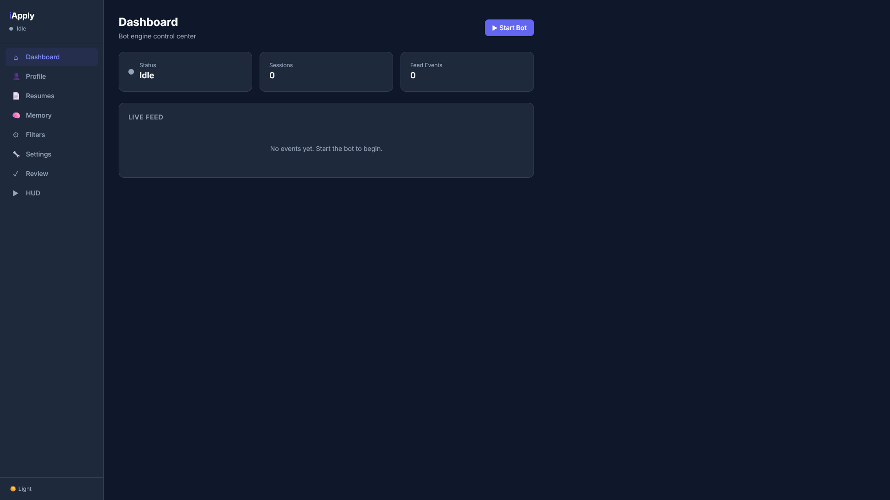
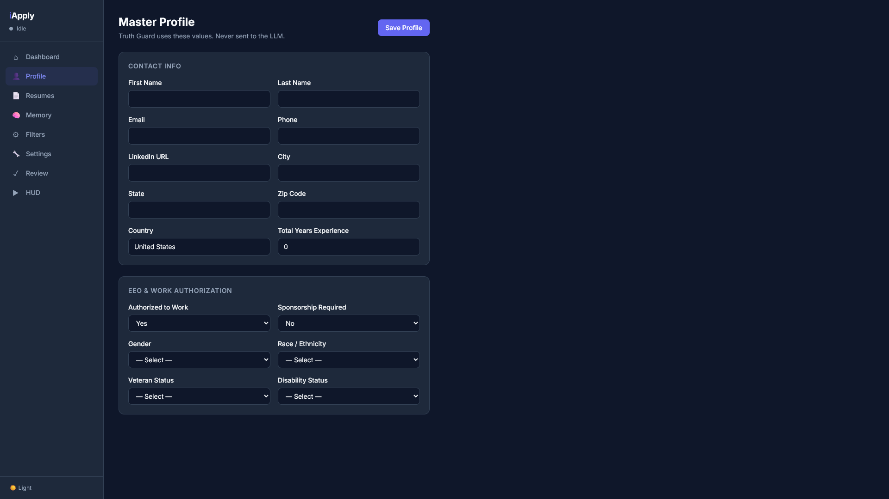
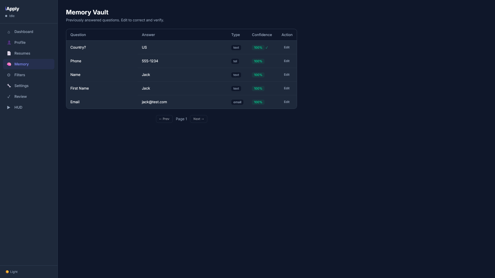
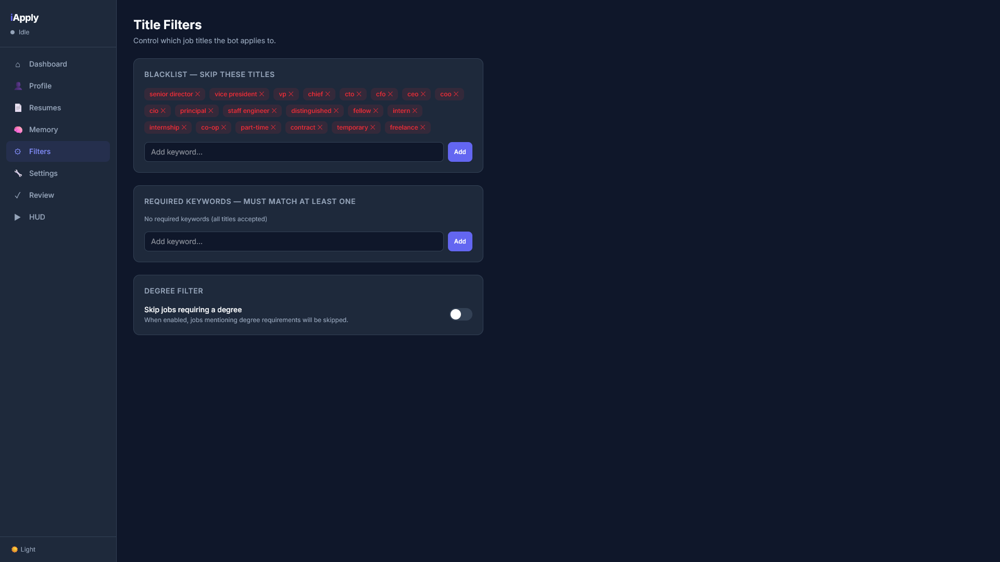
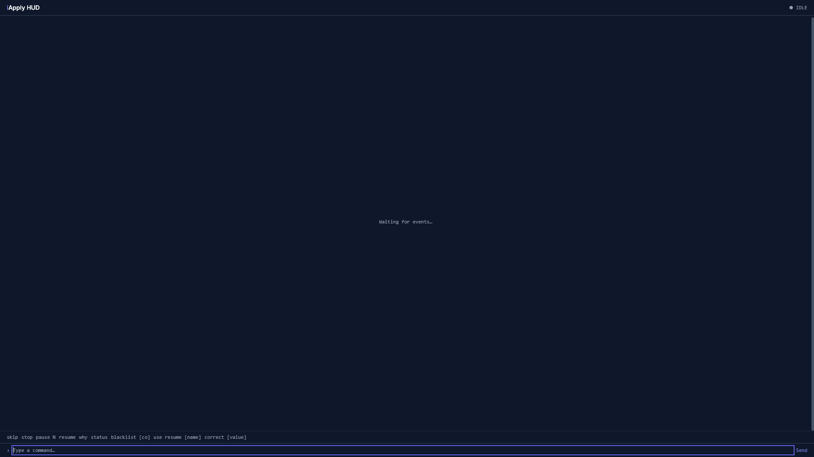
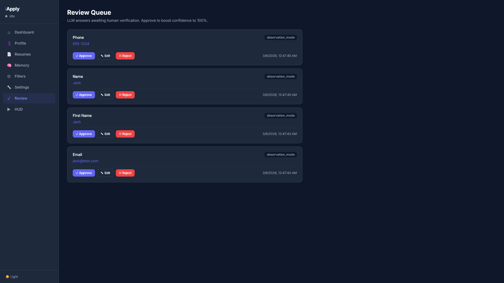
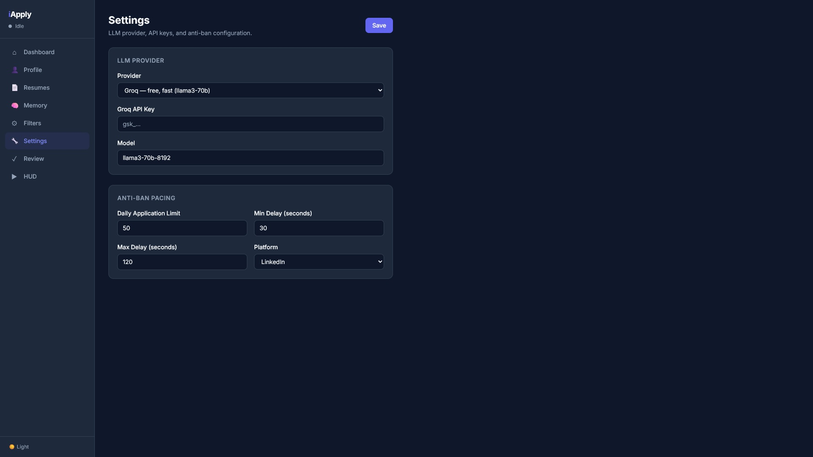

<h1> Ryan Duckworth's Cybersecurity / Software Engineering Portfolio</h1>

 <b>Google Cybersecurity Professional Certificate</b> 
<a href="https://www.credly.com/go/r40cBjqO">Credly</a> • <a href="https://coursera.org/verify/professional-cert/PI4BPP81NMYI">Coursera</a>

  

<table align="center">
  <tr>
    <td align="center" style="padding: 16px;">
      
       <b>Fortinet Certified Associate in Cybersecurity</b> 
      <a href="https://www.credly.com/earner/earned/badge/77f49afa-bb70-4b71-a741-4f529794e6ff">Credly</a> • <a href="https://github.com/rduckworthfl-ux/Cybersecurity-Portfolio/blob/main/10_certifications/Fortinet%20Certified%20Associate%20in%20Cybersecurity.PDF.pdf">Certificate ↗</a>
    </td>
    <td align="center" style="padding: 16px;">
      
       <b>NSE 3 – FortiGate Operator Exam v7.6</b> 
      <a href="https://training.fortinet.com">Fortinet NSE Program ↗</a>
    </td>
  </tr>
</table>

---

Detail-oriented and proactive **Cybersecurity Analyst** with a passion for protecting digital assets.
Strong foundation in **threat detection, incident response, and vulnerability management**, backed by hands-on projects and professional certification.

---

  
  
  
  
  
  
  

---

## Skills & Competencies

### Security Principles

**Defense-in-Depth** • **Principle of Least Privilege** • **Network Segmentation** • **Attack Surface Reduction** • Risk Assessment & Mitigation • Cryptography & Data Integrity • Cloud Security & OCI Hardening • SIEM / IDS / IPS

### Software Engineering & Development

**Backend Development:** Python (Flask, Celery, Redis) • RESTful API Design • Microservices Architecture • Background Task Processing • Database Design (PostgreSQL, Supabase)

**Algorithms & Data Structures:** Hash Maps • Sets • Stacks • Two Pointers • Sliding Window • O(n) Time Optimization • LeetCode (70%+ avg performance)

**Version Control & CI/CD:** Git • GitHub • Docker • Docker Compose • Automated Testing • Code Review

**Full-Stack:** TypeScript/React (Frontend) • PostgREST • Edge Functions • Real-time Dashboards

### Tools & Technologies

**Network & Security:** Wireshark • Nmap • Nessus • Metasploit • Firewall Configuration (UFW) • Antivirus Setup (ClamAV) • Browser Security (uBlock Origin) • FortiGate (FortiOS) • Web Filtering • SSL Inspection • Application Control • Intrusion Detection Systems

**Programming & Scripting:** Python • Java • SQL • Bash • PowerShell • TypeScript

**Databases:** PostgreSQL • Supabase • Materialized Views • Row-Level Security (RLS) • Query Optimization • Indexing Strategies

**Backend Frameworks:** Flask • Gunicorn • Celery (Task Queue) • Redis (Message Broker)

**AI & Automation:** LangChain (Chains · Prompts · Output Parsers) • Retrieval-Augmented Generation (RAG) • FAISS Vector Store • Semantic Document Retrieval • LLM API Integration (Groq / Llama 3) • Selenium WebDriver • ChromeDriver • Prompt Engineering & Template Design • Local AI Inference Pipelines

**Virtualization & Cloud:** VMware Workstation • Oracle Cloud Infrastructure (OCI) • Docker • Docker Compose

**Forensics & Analysis:** Packet Capture • Vulnerability Scanning • System Auditing

**Incident Response & Forensics:** Windows Event Log Analysis • Process Timeline Reconstruction • CVSS Risk Assessment • Forensic Investigation • Malware Detection • System Compromise Analysis • Root Cause Analysis

### Operating Systems

Windows (Client & Server) • Linux (Kali, Ubuntu, Lubuntu) • Linux Installation & Troubleshooting

### Core Competencies

**Security:** Network Security • Penetration Testing • Threat Analysis • Incident Response • Vulnerability Management • System Hardening • Endpoint Hardening (Linux) • Compliance

**Engineering:** Algorithm Optimization • Database Architecture • API Development • Performance Tuning • Technical Documentation • Problem Decomposition • Production Debugging

---

## Flagship Project: Vappler

As the lead developer, I am building **Vappler** (_Vulnerability Attack Path Doppler_), a next-generation vulnerability management and security monitoring platform. It's designed to provide security professionals and MSSPs with a comprehensive toolset to analyze, prioritize, and track security findings across all client assets.

Check out the [Vappler GitHub repository](https://github.com/aspida-security/vappler-docs) for more information.

  
  

|                                                    Security Dashboard View                                                    |
| :---------------------------------------------------------------------------------------------------------------------------: |
|  |

---

### iApply

**iApply** is a locally-hosted, privacy-first job application assistant built by Aspida Security. It uses a Retrieval-Augmented Generation (RAG) pipeline backed by a FAISS vector store and Groq (Llama 3) to intelligently fill application forms — learning from every session and storing all data in an AES-256-GCM encrypted local vault. The application is engineered with layered security controls including Argon2id key derivation, OS-native credential storage, network isolation, and LLM prompt injection defenses.

  

---

## Application Screenshots

 <i>Dashboard — engine control center with live feed, session counter, and status indicator</i>

  

<table>
  <tr>
    <td align="center">
      
       Dashboard
    </td>
    <td align="center">
      
       Master Profile
    </td>
    <td align="center">
      
       Memory Vault
    </td>
    <td align="center">
      
       Title Filters
    </td>
  </tr>
  <tr>
    <td align="center">
      
       HUD — Live Command Interface
    </td>
    <td align="center">
      
       Review Queue
    </td>
    <td align="center">
      
       Settings
    </td>
    <td align="center"></td>
  </tr>
</table>

---

## Portfolio Projects

| Project Title                                                                                                                | Category                                                       |
| :--------------------------------------------------------------------------------------------------------------------------- | :------------------------------------------------------------- |
| [00. LeetCode Security Patterns](./00_leetcode_security_patterns/)                                                           | Algorithms / Software Engineering / Cybersecurity Applications |
| [01. Professional Statement](./01_professional_statement/)                                                                   | Career Development                                             |
| [02. Analyzing Network Structure & Security](./02_analyzing_network_structure_and_security/)                                 | Network Security                                               |
| [03. Conducting a Security Audit](./03_conducting_a_security_audit/)                                                         | Risk Management                                                |
| [04. Identifying Vulnerabilities for a Small Business](./04_identifying_vulnerabilities_for_a_small_business/)               | Vulnerability Assessment                                       |
| [05. Managing File Permissions in Linux](./05_managing_file_permissions_in_linux/)                                           | Linux Administration                                           |
| [06. Applying Filters to SQL Queries](./06_applying_filters_to_sql_queries/)                                                 | SQL & Data Analysis                                            |
| [07. Documenting an Incident Handler's Journal](./07_documenting_an_incident_handlers_journal/)                              | Incident Response                                              |
| [08. Importing & Parsing a Text File with Python](./08_importing_and_parsing_a_text_file/)                                   | Python & Automation                                            |
| [09. Cloud Server Hardening with OCI](./09_cloud_server_hardening_with_oci/)                                                 | Cloud Security                                                 |
| [10. Certifications](./10_certifications/)                                                                                   | Professional Development                                       |
| [11. Data Integrity Verification Tool](./11_data_integrity_verifier/)                                                        | Cryptography / Java Development                                |
| [12. Vulnerability Assessment and Penetration Test for a SMB](./12_Vulnerability_Assessment_and_Penetration_Test_for_a_SMB/) | Vulnerability Assessment / Penetration Testing                 |
| [13. Secure LAN File Share Configuration](./13_Secure_LAN_File_Share_Configuration/)                                         | Network Security / System Administration                       |
| [14. Secure OS Migration and Endpoint Hardening](./14_secure_os_migration_and_endpoint_hardening_for_legacy_hardware/)       | OS Migration / Endpoint Security / Linux Hardening             |
| [15. Port Reservation Forensic Investigation](./15_Port_Reservation_Forensic_Investigation/)                                 | Incident Response / Forensics Analysis / System Administration |
| [16. Secure NAS Migration & Legacy Hardening](./16_Secure_NAS_Migration_and_Legacy_Hardware_Repurposing/)                    | Network Security / System Admin / Disaster Recovery            |
| [17. Secure Linux Dev Infrastructure & Hardening](./17_Secure_Linux_Dev_Infrastructure_and_Hardening/)                       | System Hardening / DevSecOps                                   |
| [18. Linux System Recovery & Administrative Fail Safe](./18_Linux_System_Recovery_and_Administrative_Fail_Safe/)             | System Recovery / Forensics                                    |
| [19. iApply — Local RAG Application](./19_iApply/)                                                                           | AI / RAG / LLM Integration / Secure Application Design         |

---

## Contact

**LinkedIn:** [linkedin.com/in/rduckworthfl333](https://www.linkedin.com/in/rduckworthfl333)  
**Email:** rduckworth@aspidasecurity.io

---

_"Cybersecurity is not just about defense — it’s about foresight, resilience, and precision.”_

