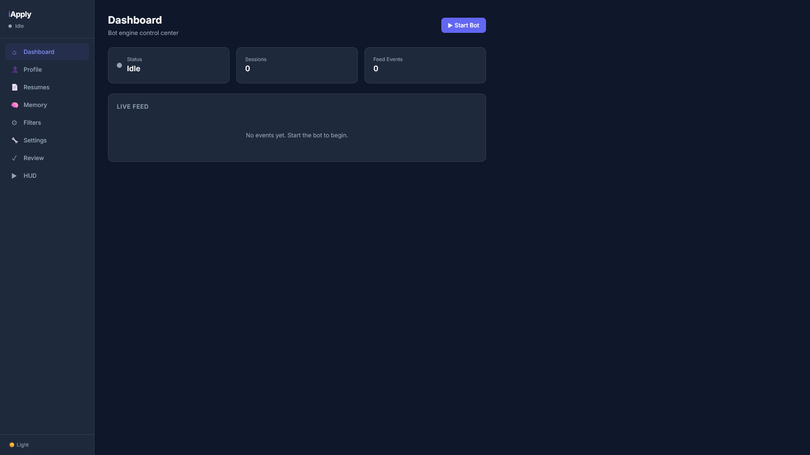
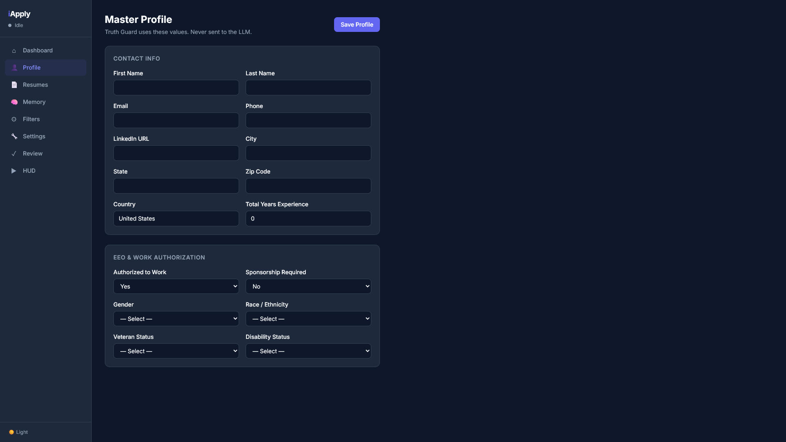
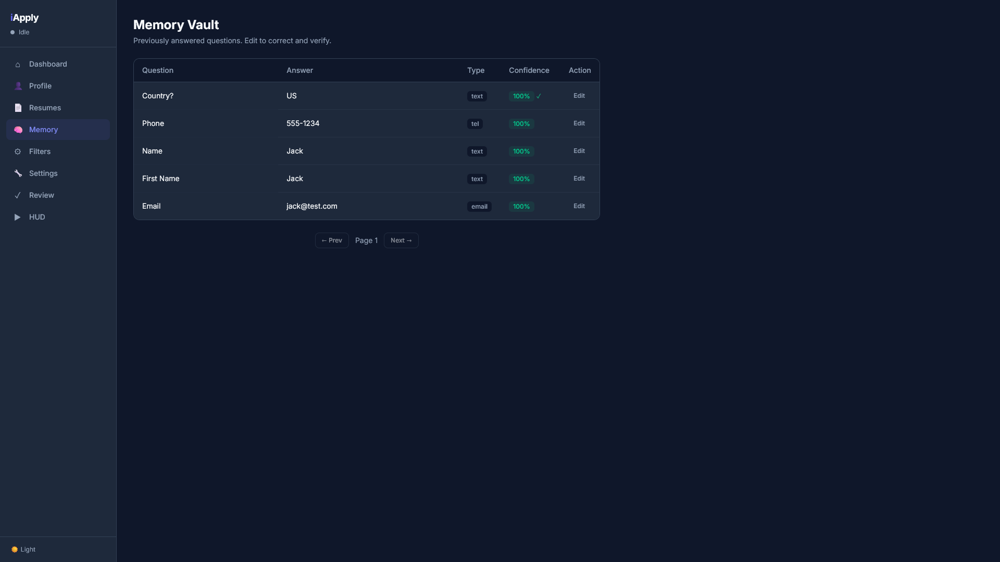
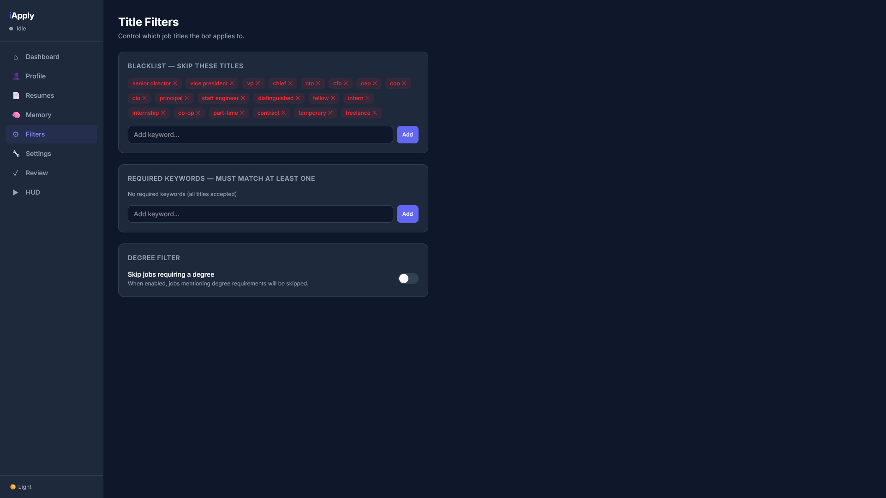
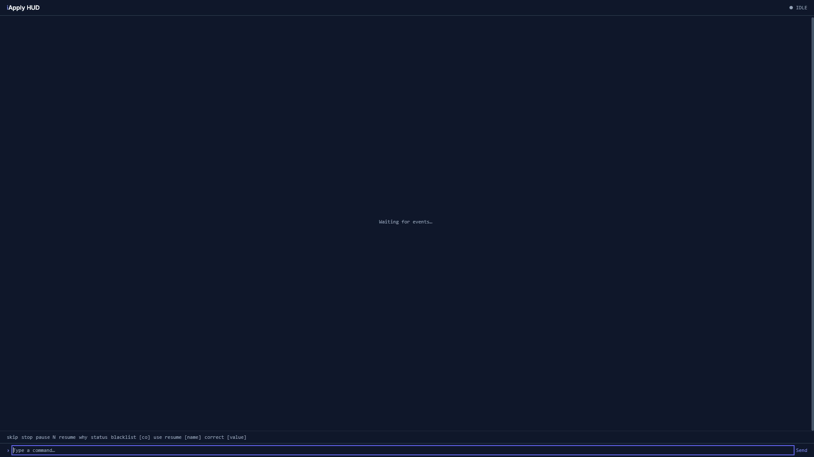
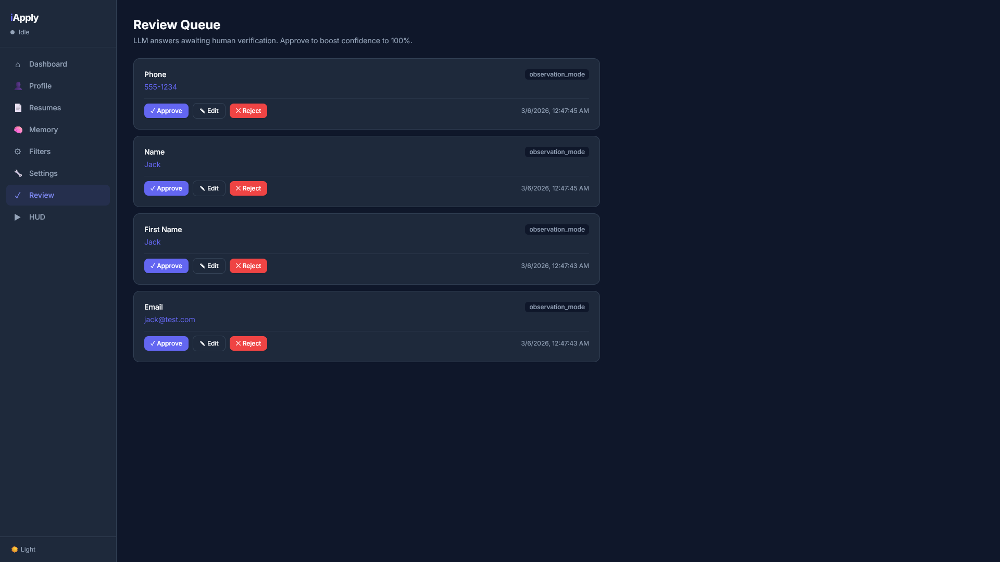
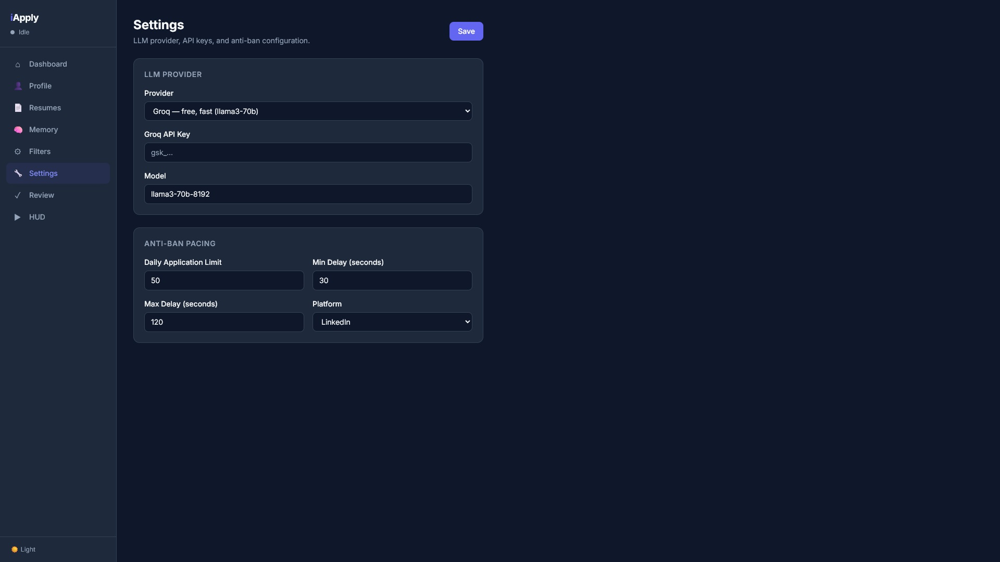

<h1>Ryan Duckworth's Cybersecurity / Software Engineering Portfolio</h1>

 
<h3>Google Cybersecurity Professional Certificate</h3>
<a href="https://www.credly.com/go/r40cBjqO">Credly</a> • <a href="https://coursera.org/verify/professional-cert/PI4BPP81NMYI">Coursera</a>

  

<table align="center">
  <tr>
    <td align="center" style="padding: 16px;">
      
       <b>Fortinet Certified Associate in Cybersecurity</b> 
      <a href="https://www.credly.com/earner/earned/badge/77f49afa-bb70-4b71-a741-4f529794e6ff">Credly</a> • <a href="https://github.com/rduckworthfl-ux/Cybersecurity-Portfolio/blob/main/00-certifications/Fortinet%20Certified%20Associate%20in%20Cybersecurity.PDF.pdf">Certificate ↗</a>
    </td>
    <td align="center" style="padding: 16px;">
      
       <b>NSE 3 – FortiGate Operator Exam v7.6</b> 
      <a href="https://training.fortinet.com">Fortinet NSE Program ↗</a>
    </td>
    <td align="center" style="padding: 16px;">
      
       <b>CCNA: Introduction to Networks</b> 
      <a href="https://github.com/rduckworthfl-ux/Cybersecurity-Portfolio/blob/main/00-certifications/CCNA-_Introduction_to_Networks_certificate_rduckw2-live-spcollege-edu_537afdb4-09ae-4337-a685-a0d69d4846f4.pdf">Certificate ↗</a>
    </td>
  </tr>
</table>

 

  <a href="#skills--competencies">Skills</a> •
  <a href="#flagship-project-vappler">Flagship Project</a> •
  <a href="#iapply">iApply</a> •
  <a href="#portfolio-projects">Portfolio Projects</a> •
  <a href="./00-certifications/">Certifications</a> •
  <a href="#contact">Contact</a>

---

Detail-oriented and proactive **Cybersecurity Analyst** with a passion for protecting digital assets.
Strong foundation in **threat detection, incident response, and vulnerability management**, backed by hands-on projects and professional certification.

---

  
  
  
  
  
  
  
  
  
  
  
  
  
  
  
  
  

---

## Skills & Competencies

### Security Principles

**Detection Engineering** • **Honeytoken Design** • **Security Automation** • **ChatOps Integration** • **Ticketing Workflow Design** • **MITRE ATT&CK Mapping** • **Defense-in-Depth** • **Principle of Least Privilege** • **Network Segmentation** • **Attack Surface Reduction** • Risk Assessment & Mitigation • Cryptography & Data Integrity • Cloud Security & OCI Hardening • SIEM / IDS / IPS • Availability Incident Response • CIA Triad Analysis

### Software Engineering & Development

**Backend Development:** Python (Flask, Celery, Redis) • RESTful API Design • Microservices Architecture • Background Task Processing • Database Design (PostgreSQL, Supabase)

**Algorithms & Data Structures:** Hash Maps • Sets • Stacks • Two Pointers • Sliding Window • O(n) Time Optimization • LeetCode (70%+ avg performance)

**Version Control & CI/CD:** Git • GitHub • Docker • Docker Compose • Automated Testing • Code Review

**Full-Stack:** TypeScript/React (Frontend) • PostgREST • Edge Functions • Real-time Dashboards

### Tools & Technologies

**Network & Security:** Wireshark • Nmap • Nessus • Metasploit • Firewall Configuration (UFW, `iptables`) • OpenWRT Wireless Hardening • Antivirus Setup (ClamAV) • Browser Security (uBlock Origin) • FortiGate (FortiOS) • Web Filtering • SSL Inspection • Application Control • Intrusion Detection Systems • Hydra Password Auditing • Network Access Control (NAC)

**SIEM & Log Management:** Wazuh • OpenSearch • OpenSearch Dashboard • Sysmon for Linux (EventID 1/3/5) • ISM (Index State Management) Policy Design • Index Lifecycle Management • OpenSearch REST API • Log Retention Strategy

**Programming & Scripting:** Python • Java • SQL • Bash • PowerShell • TypeScript

**Automation & Collaboration:** Jira Cloud • Discord Webhooks • Wazuh Integrator • REST API Integration • JSON Payload Transformation • Alert Escalation Workflow Design

**Databases:** PostgreSQL • Supabase • Materialized Views • Row-Level Security (RLS) • Query Optimization • Indexing Strategies

**Backend Frameworks:** Flask • Gunicorn • Celery (Task Queue) • Redis (Message Broker)

**AI & Automation:** LangChain (Chains · Prompts · Output Parsers) • Retrieval-Augmented Generation (RAG) • FAISS Vector Store • Semantic Document Retrieval • LLM API Integration (Groq / Llama 3, Google Gemini) • Selenium WebDriver • ChromeDriver • Prompt Engineering & Template Design • Local AI Inference Pipelines • RSS/XML Ingestion (`feedparser`) • Push Notification Delivery (`ntfy`) • systemd Timers for Scheduled Automation

**Active Directory:** Samba AD DC • samba-tool • Kerberos / NTLMv2 • OU Hierarchy Design & Scoping • Honeytoken Account Injection • Group Policy Objects (GPO) • Group Policy Management Console • Group Policy Preferences (GPP) • Administrative Templates • Account Lockout Policy Enforcement • Logon/Logoff Scripting • Local Security Policy Scoping • `gpresult` / RSoP Verification

**Windows Administration:** Windows Server Backup • `wbadmin` • NTFS ACL Management • Volume Shadow Copy Service (VSS) • Local User/Account Provisioning • PowerShell Scripting

**Virtualization & Cloud:** VMware Workstation • Oracle Cloud Infrastructure (OCI) • Tailscale Mesh VPN • Docker • Docker Compose • LVM Administration (pvresize · lvextend · resize2fs)

**Storage & Disk Management:** LVM Logical Volume Management • Filesystem Expansion (resize2fs) • Docker Volume Forensics • ncdu • du / df • Disk Utilization Analysis

**Forensics & Analysis:** Packet Capture • Vulnerability Scanning • System Auditing • Docker Volume Inspection • Container Lifecycle Forensics

**Incident Response & Forensics:** Windows Event Log Analysis • Process Timeline Reconstruction • CVSS Risk Assessment • Forensic Investigation • Malware Detection • System Compromise Analysis • Root Cause Analysis • SIEM Availability Incident Response • NIST SP 800-61 Incident Handling

### Operating Systems

Windows (Client & Server) • Linux (Kali, Ubuntu, Lubuntu) • Linux Installation & Troubleshooting

### Core Competencies

**Security:** Network Security • Penetration Testing • Threat Analysis • Incident Response • Vulnerability Management • System Hardening • Endpoint Hardening (Linux) • SIEM Operations & Administration • Security Automation • Ticketing & ChatOps Workflow Operations • Compliance

**Engineering:** Algorithm Optimization • Database Architecture • API Development • Performance Tuning • Technical Documentation • Problem Decomposition • Production Debugging

---

## Flagship Project: Vappler

As the lead developer, I am building **Vappler** (_Vulnerability Attack Path Doppler_), a next-generation vulnerability management and security monitoring platform. It's designed to provide security professionals and MSSPs with a comprehensive toolset to analyze, prioritize, and track security findings across all client assets.

Check out the [Vappler GitHub repository](https://github.com/aspida-security/vappler-docs) for more information.

  
  

|                                                    Security Dashboard View                                                    |
| :---------------------------------------------------------------------------------------------------------------------------: |
|  |

---

### iApply

**iApply** is a locally-hosted, privacy-first job application assistant built by Aspida Security. It uses a Retrieval-Augmented Generation (RAG) pipeline backed by a FAISS vector store and Groq (Llama 3) to intelligently fill application forms - learning from every session and storing all data in an AES-256-GCM encrypted local vault. The application is engineered with layered security controls including Argon2id key derivation, OS-native credential storage, network isolation, and LLM prompt injection defenses.

  

---

## Application Screenshots

 <i>Dashboard - engine control center with live feed, session counter, and status indicator</i>

  

<table>
  <tr>
    <td align="center">
      
       Dashboard
    </td>
    <td align="center">
      
       Master Profile
    </td>
    <td align="center">
      
       Memory Vault
    </td>
    <td align="center">
      
       Title Filters
    </td>
  </tr>
  <tr>
    <td align="center">
      
       HUD  -  Live Command Interface
    </td>
    <td align="center">
      
       Review Queue
    </td>
    <td align="center">
      
       Settings
    </td>
    <td align="center"></td>
  </tr>
</table>

---

## Portfolio Projects

| Project Title                                                                                                                | Category                                                           |
| :----------------------------------------------------------------------------------------------------------------------------- | :------------------------------------------------------------------ |
| [00. Certifications](./00-certifications/)                                                                                    | Professional Development                                                      |
| [00. LeetCode Security Patterns](./00-leetcode-security-patterns/)                                                            | Algorithms / Software Engineering / Cybersecurity Applications      |
| [01. Professional Statement](./01-professional-statement/)                                                                    | Career Development                                                   |
| [02. Analyzing Network Structure & Security](./02-analyzing-network-structure-and-security/)                                  | Network Security                                                      |
| [03. Conducting a Security Audit](./03-conducting-a-security-audit/)                                                          | Risk Management                                                        |
| [04. Identifying Vulnerabilities for a Small Business](./04-identifying-vulnerabilities-for-a-small-business/)                | Vulnerability Assessment                                                |
| [05. Managing File Permissions in Linux](./05-managing-file-permissions-in-linux/)                                            | Linux Administration                                                     |
| [06. Applying Filters to SQL Queries](./06-applying-filters-to-sql-queries/)                                                   | SQL & Data Analysis                                                        |
| [07. Documenting an Incident Handler's Journal](./07-documenting-an-incident-handlers-journal/)                               | Incident Response                                                           |
| [08. Importing & Parsing a Text File with Python](./08-importing-and-parsing-a-text-file/)                                    | Python & Automation                                                          |
| [09. Cloud Server Hardening with OCI](./09-cloud-server-hardening-with-oci/)                                                  | Cloud Security                                                                |
| [10. Penetration Testing & Vulnerability Assessment Report](./10-penetration-test-and-vulnerability-assessment-report/)       | Penetration Testing / Metasploit / Exploitation & Post-Exploitation           |
| [11. Data Integrity Verification Tool](./11-data-integrity-verifier/)                                                         | Cryptography / Java Development                                                |
| [12. Vulnerability Assessment and Penetration Test for a SMB](./12-vulnerability-assessment-and-penetration-test-for-a-smb/)  | Vulnerability Assessment / Penetration Testing                                   |
| [13. Secure LAN File Share Configuration](./13-secure-lan-file-share-configuration/)                                          | Network Security / System Administration                                         |
| [14. Secure OS Migration and Endpoint Hardening](./14-secure-os-migration-and-endpoint-hardening-for-legacy-hardware/)        | OS Migration / Endpoint Security / Linux Hardening                                 |
| [15. Port Reservation Forensic Investigation](./15-port-reservation-forensic-investigation/)                                  | Incident Response / Forensics Analysis / System Administration                      |
| [16. Secure NAS Migration & Legacy Hardening](./16-secure-nas-migration-and-legacy-hardware-repurposing/)                     | Network Security / System Admin / Disaster Recovery                                  |
| [17. Secure Linux Dev Infrastructure & Hardening](./17-secure-linux-dev-infrastructure-and-hardening/)                        | System Hardening / DevSecOps                                                          |
| [18. Linux System Recovery & Administrative Fail Safe](./18-linux-system-recovery-and-administrative-fail-safe/)              | System Recovery / Forensics                                                             |
| [19. iApply - Local RAG Application](./19-iapply-local-rag-application/)                                                      | AI / RAG / LLM Integration / Secure Application Design                                   |
| [20. Wazuh SIEM Availability Incident Response](./20-wazuh-siem-availability-incident-response/)                              | Incident Response / SIEM Operations / Linux System Administration                        |
| [21. Wazuh SOC Lab: Samba AD Honeytoken Detection](./21-wazuh-samba-ad-honeytoken-lab/)                                       | Detection Engineering / Active Directory / SIEM / MITRE ATT\&CK                            |
| [22. Automated SIEM Ticketing and ChatOps Pipeline](./22-automated-siem-ticketing-and-chatops-pipeline/)                      | SIEM Automation / ChatOps / Ticketing / Detection Engineering                               |
| [23. FTP Brute-Force & Plaintext Credential Traffic Analysis](./23-ftp-bruteforce-traffic-analysis/)                          | Network Traffic Analysis / Password Attacks / Wireshark                                     |
| [24. Windows GPO Scripting & Troubleshooting](./24-windows-gpo-scripting-and-troubleshooting/)                                | Active Directory / Group Policy / Systematic Troubleshooting                                 |
| [25. Linux Data Archival & Recovery Lab](./25-linux-data-archival-and-recovery/)                                              | Linux Administration / Backup & Disaster Recovery                                             |
| [26. Linux User Provisioning & Forced Password Rotation](./26-linux-user-provisioning-and-forced-password-rotation/)          | Identity & Access Management / Linux Administration                                            |
| [27. Windows Server Backup & ACL Preservation](./27-windows-server-backup-and-acl-preservation/)                              | Windows Administration / Backup & Disaster Recovery / NTFS ACLs                                 |
| [28. Secure Wireless Access & Jump Box Hardening](./28-secure-wireless-access-and-jumpbox-hardening/)                         | Network Security / Host Hardening / Centralized Logging                                          |
| [29. Dynamic Firewall Provisioning & Network Access Control](./29-dynamic-firewall-provisioning-and-nac/)                     | Network Security / iptables / Least Privilege Architecture                                        |
| [30. Clipboard Race Condition Case Study](./30-clipboard-race-condition-case-study/)                                         | Security Engineering / Application Security / Root Cause Analysis                                  |
| [31. Daily Threat Brief: RSS-to-LLM Automation Pipeline](./31-daily-threat-research-automation/)                             | Security Automation / LLM Integration / Threat Intelligence                                          |

---

## Contact

**LinkedIn:** [linkedin.com/in/rduckworthfl333](https://www.linkedin.com/in/rduckworthfl333) • **Email:** [rduckworth@aspidasecurity.io](mailto:rduckworth@aspidasecurity.io)

---

_"Cybersecurity is not just about defense - it's about foresight, resilience, and precision."_

