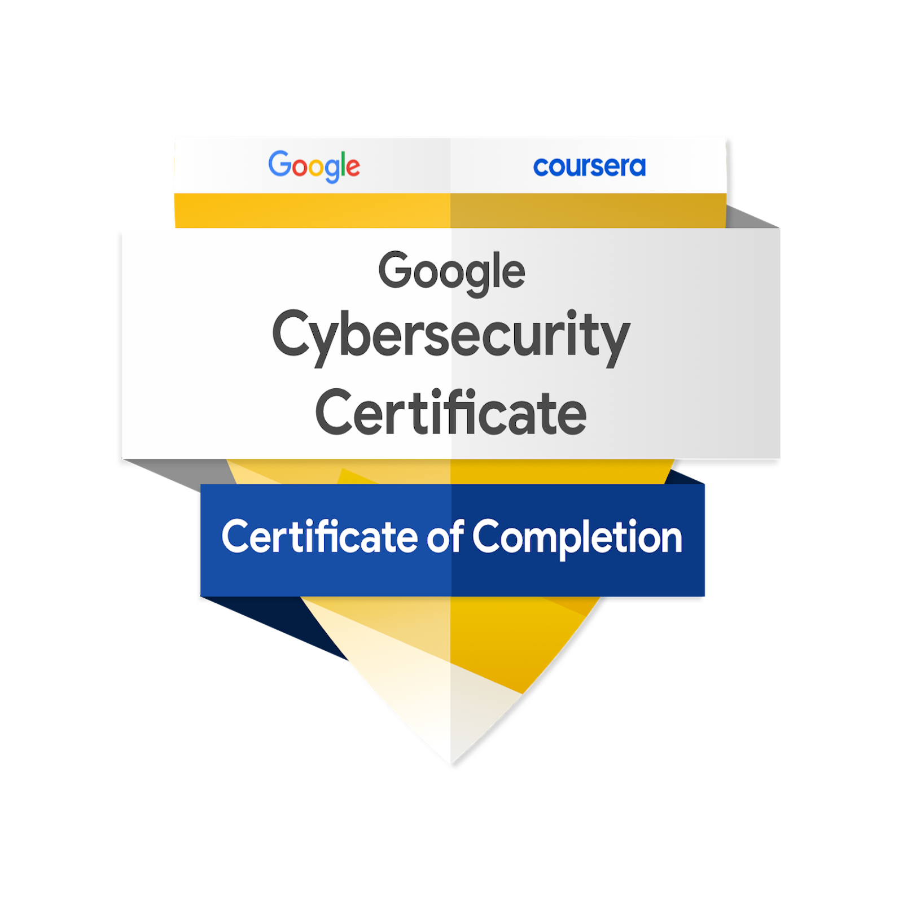

<!-- Banner -->

  

<!-- Certification Badge -->

  

 

[View Credly Badge](https://www.credly.com/go/r40cBjqO) • [View Coursera Certificate](https://coursera.org/verify/professional-cert/PI4BPP81NMYI)

---

<!-- Main Header -->
<h1 align="center">🛡️ Ryan Duckworth's Cybersecurity Portfolio</h1>

Detail‑oriented and proactive <b>Cybersecurity Analyst</b> with a passion for protecting digital assets.  
Strong foundation in <b>threat detection, incident response, and vulnerability management</b>, backed by hands‑on projects and professional certification.

---

<!-- Skill Badges -->

  
  
  
  
  
  
  

---

<h1 align="center">🛡️ Ryan Duckworth's Cybersecurity Portfolio</h1>

Detail‑oriented and proactive <b>Cybersecurity Analyst</b> with a passion for protecting digital assets and a strong foundation in security principles.  
Eager to apply technical expertise and hands‑on experience from the <b>Google Cybersecurity Professional Certificate</b> to contribute to <b>threat detection, incident response, and vulnerability management</b>.

---

<!-- Tech/Skill Badges -->

  
  
  
  
  
  
  

---

## 🧰 Skills & Competencies

### 🔐 Security Principles
**Defense-in-Depth** & **Principle of Least Privilege**  
**Network Segmentation** & **Attack Surface Reduction**  
Risk Assessment, Prioritization & Mitigation  
Cryptography & Data Integrity  
Cloud Security & OCI Hardening  
SIEM Tools, IDS/IPS, Log Analysis  

### 🛠️ Tools & Technologies
**Network & Security:** Wireshark, Nmap, Nessus, Metasploit  
**Programming & Scripting:** Python, Java, SQL, Bash, PowerShell  
**Virtualization & Cloud:** VMware Workstation, Oracle Cloud Infrastructure (OCI)  
**Forensics & Analysis:** Packet Capture, Vulnerability Scanning, System Auditing  

### 💻 Operating Systems
Windows (Client & Server)  
Linux (Kali, Ubuntu)  

### 🎯 Core Competencies
Network Security & Secure Configuration  
Penetration Testing & Exploit Research  
Threat Analysis & Incident Response  
Vulnerability Management & Patch Strategy  
System Hardening & Compliance  
Technical Documentation & Reporting  

---

## 📂 Portfolio Projects

| Project Title | Category |
| :--- | :--- |
| [01. Professional Statement](./01_professional_statement/) | Career Development |
| [02. Analyzing Network Structure & Security](./02_analyzing_network_structure_and_security/) | Network Security |
| [03. Conducting a Security Audit](./03_conducting_a_security_audit/) | Risk Management |
| [04. Identifying Vulnerabilities for a Small Business](./04_identifying_vulnerabilities_for_a_small_business/) | Vulnerability Assessment |
| [05. Managing File Permissions in Linux](./05_managing_file_permissions_in_linux/) | Linux Administration |
| [06. Applying Filters to SQL Queries](./06_applying_filters_to_sql_queries/) | SQL & Data Analysis |
| [07. Documenting an Incident Handler's Journal](./07_documenting_an_incident_handlers_journal/) | Incident Response |
| [08. Importing & Parsing a Text File with Python](./08_importing_and_parsing_a_text_file/) | Python & Automation |
| [09. Cloud Server Hardening with OCI](./09_cloud_server_hardening_with_oci/) | Cloud Security |
| [10. Certifications](./10_certifications/) | Professional Development |
| [11. Data Integrity Verification Tool](./11_data_integrity_verifier/) | Cryptography / Java Development |
| [12. Vulnerability Assessment and Penetration Test for a SMB](./12_Vulnerability_Assessment_and_Penetration_Test_for_a_SMB/) | Vulnerability Assessment / Penetration Testing |
| [13. Secure LAN File Share Configuration](./13_Secure_LAN_File_Share_Configuration/) | Network Security / System Administration |

---

## 📫 Contact

- **LinkedIn:** [linkedin.com/in/rduckworthfl333](https://www.linkedin.com/in/rduckworthfl333)  
- **Email:** 8eq5iybyg@mozmail.com  

---

<i>“Cybersecurity is not just about defense — it’s about foresight, resilience, and precision.”</i>

  

<h1>🛡️ Ryan Duckworth's Cybersecurity Portfolio</h1>

  

 

[View Credly Badge](https://www.credly.com/go/r40cBjqO) • [View Coursera Certificate](https://coursera.org/verify/professional-cert/PI4BPP81NMYI)

---

Detail‑oriented and proactive <b>Cybersecurity Analyst</b> with a passion for protecting digital assets.  
Strong foundation in <b>threat detection, incident response, and vulnerability management</b>, backed by hands‑on projects and professional certification.

---

  
  
  
  
  
  
  

---

## 🧰 Skills & Competencies

### 🔐 Security Principles
**Defense-in-Depth** • **Principle of Least Privilege** • **Network Segmentation** • **Attack Surface Reduction** Risk Assessment & Mitigation • Cryptography & Data Integrity • Cloud Security & OCI Hardening • SIEM / IDS / IPS  

### 🛠️ Tools & Technologies
**Network & Security:** Wireshark • Nmap • Nessus • Metasploit  
**Programming & Scripting:** Python • Java • SQL • Bash • PowerShell  
**Virtualization & Cloud:** VMware Workstation • Oracle Cloud Infrastructure (OCI)  
**Forensics & Analysis:** Packet Capture • Vulnerability Scanning • System Auditing  

### 💻 Operating Systems
Windows (Client & Server) • Linux (Kali, Ubuntu)  

### 🎯 Core Competencies
Network Security • Penetration Testing • Threat Analysis • Incident Response  
Vulnerability Management • System Hardening • Compliance • Technical Documentation  

---

## 🚀 My New Daily Driver: The Comet AI Browser

I've completely switched my workflow to the <b>Comet AI Browser</b>, and it's fantastic. It's incredibly snappy, responsive, and integrates all my Chrome extensions into a clean, intuitive UI.  The built-in AI assistant is a game-changer—it can run automated tasks and access multiple AI models (like GPT-4 and Claude 3) right from one spot. I use it for all my security research and coding.

Try it out and get a <b>free month of Perplexity Pro ($20 value) on me!</b>

<b>How to get your free month of Pro:</b>
  1. Click the image above to download Comet.
  2. Install it and sign up/log in.
  3. Your free month of Perplexity Pro will be automatically applied!

---

## 🚀 Flagship Project: Vulcan Scan

  

  As the lead developer, I am building <b>Vulcan Scan</b>, a next-generation vulnerability management and security monitoring platform.  
  It's designed to provide security professionals and MSSPs with a comprehensive toolset to analyze, prioritize, and track security findings across all client assets.

  
  

<table align="center" border="0" cellpadding="10" style="border: none;">
  <tr>
    <td style="border: none;"></td>
    <td style="border: none;"></td>
  </tr>
  <tr align="center">
    <td style="border: none;"><b>Main Security Dashboard</b></td>
    <td style="border: none;"><b>Vulnerability Management View</b></td>
  </tr>
</table>

---

## 📂 Portfolio Projects

| Project Title | Category |
| :--- | :--- |
| [01. Professional Statement](./01_professional_statement/) | Career Development |
| [02. Analyzing Network Structure & Security](./02_analyzing_network_structure_and_security/) | Network Security |
| [03. Conducting a Security Audit](./03_conducting_a_security_audit/) | Risk Management |
| [04. Identifying Vulnerabilities for a Small Business](./04_identifying_vulnerabilities_for_a_small_business/) | Vulnerability Assessment |
| [05. Managing File Permissions in Linux](./05_managing_file_permissions_in_linux/) | Linux Administration |
| [06. Applying Filters to SQL Queries](./06_applying_filters_to_sql_queries/) | SQL & Data Analysis |
| [07. Documenting an Incident Handler's Journal](./07_documenting_an_incident_handlers_journal/) | Incident Response |
| [08. Importing & Parsing a Text File with Python](./08_importing_and_parsing_a_text_file/) | Python & Automation |
| [09. Cloud Server Hardening with OCI](./09_cloud_server_hardening_with_oci/) | Cloud Security |
| [10. Certifications](./10_certifications/) | Professional Development |
| [11. Data Integrity Verification Tool](./11_data_integrity_verifier/) | Cryptography / Java Development |
| [12. Vulnerability Assessment and Penetration Test for a SMB](./12_Vulnerability_Assessment_and_Penetration_Test_for_a_SMB/) | Vulnerability Assessment / Penetration Testing |
| [13. Secure LAN File Share Configuration](./13_Secure_LAN_File_Share_Configuration/) | Network Security / System Administration |

---

## 📫 Contact

**LinkedIn:** [linkedin.com/in/rduckworthfl333](https://www.linkedin.com/in/rduckworthfl333)  
**Email:** 8eq5iybyg@mozmail.com  

---

<i>“Cybersecurity is not just about defense — it’s about foresight, resilience, and precision.”</i>

